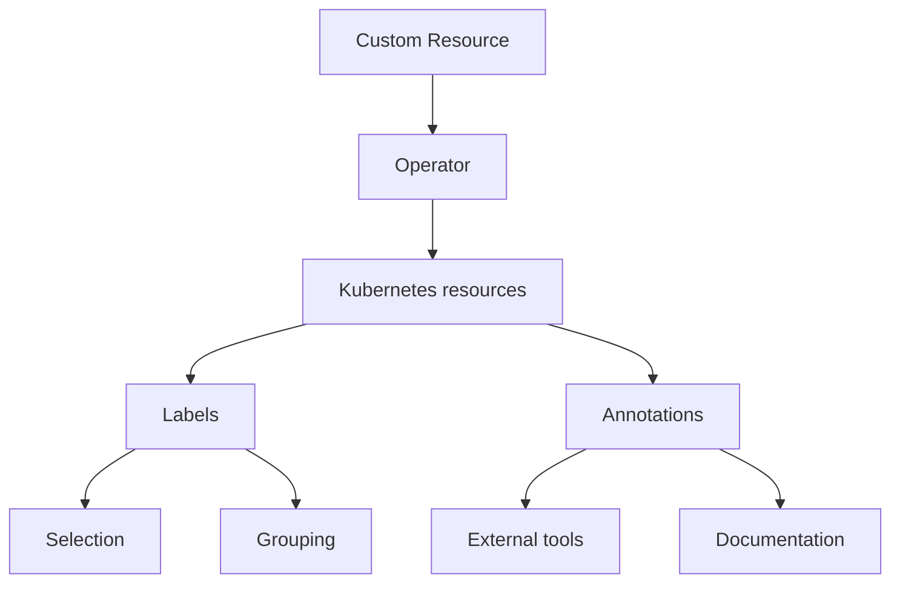

# Labels and annotations

Labels and annotations are rather similar but differ in purpose.

**Labels** are used by Kubernetes to identify and select objects. They enable filtering and grouping, allowing users to apply selectors for operations like deployments or scaling.

**Annotations** are assigning additional *non-identifying* information that doesn't affect how Kubernetes processes resources. They store descriptive information like deployment history, monitoring configurations or external integrations.

The following diagram illustrates this difference:



Both Labels and Annotations are assigned to the following objects managed by Percona Operator for MySQL:

* Custom Resource Definitions
* Custom Resources
* Deployments
* Services
* StatefulSets
* PVCs
* Pods
* ConfigMaps and Secrets

## When to use labels and annotations

Use **Labels** when:

* The information is used for object selection
* The data is used for grouping or filtering
* The information is used by Kubernetes controllers
* The data is used for operational purposes

Use **Annotations** when:

* The information is for external tools
* The information is used for debugging
* The data is used for monitoring configuration

## Labels and annotations used by Percona Operator for MySQL

### Labels

| Name                        | Objects                          | Description                                      | Example values                          |
|-----------------------------|-----------------------------------|------------------------------------------------|-----------------------------------------|
| `app.kubernetes.io/name`      | Services, StatefulSets, Deployments, etc. | Specifies the name of the application          | percona-xtradb-cluster |
| `app.kubernetes.io/instance`  | Pods, Services, StatefulSets, Deployments | Identifies a specific instance of the application | cluster1 |
| `app.kubernetes.io/managed-by`| Services, StatefulSets           | Indicates the controller managing the object    | percona-xtradb-cluster-operator |
| `app.kubernetes.io/component`| Pods, Services, StatefulSets           | Specifies the component within the application  | pxc, proxysql, haproxy                  |
| `app.kubernetes.io/part-of`   | Services, StatefulSets           | Indicates the higher-level application the object belongs to | percona-xtradb-cluster                          |
| `app.kubernetes.io/version`  | CustomResourceDefinition          | Specifies the version of the Percona XtraDB Cluster Operator. | mysql.percona.com/{{release}} |
| `percona.com/cluster` | Custom Resource | Identifies the MySQL cluster instance | cluster1 |
| `percona.com/backup-type`| Custom Resource | Specifies the type of backup being performed (e.g. cron for scheduled backups) | cron, xtrabackup |
| `percona.com/backup-name`| Custom Resource | Specifies the name of backup being performed  | backup1 |
| `percona.com/backup-job-name`| Job | Specifies the name of the backup job being performed  |  |
| `percona.com/backup-ancestor`| Custom Resource | Specifies the name of the backup that was used as a base for the current backup | cluster1-backup-2025-05-23 |
| `percona.com/restore-svc-name`| Pods, PVC | Identifies resources associated with a specific restore operation| | 
| `percona.com/restore-job-name`| Pods, Jobs | Specifies the name of a restore job being performed| |
| `rack` | Pods, Services, Deployments, StatefulSets| Identifies topology or rack awareness, often for scheduling or affinity | `rack-22`|


### Annotations

| Name            | Associated resources       | Description                 | Example values         |
|-----------------|----------------------------|-----------------------------|------------------|
| `iam.amazonaws.com/role`  | Custom Resource  | AWS IAM role for service account  | `iam.amazonaws.com/role: role-arn`                 |
| `testName`                | Backup jobs, Pods | Used for test identification in scheduled backups| `testName: scheduled-backup`                       |
| `percona.com/last-applied-tls` | Services   | Stores the hash of the last applied TLS configuration for the service |
| `percona.com/last-applied-secret` | Secrets | Stores the hash of the last applied user Secret configuration |
| `percona.com/configuration-hash` | Services | Used to track and validate configuration changes in the MySQL cluster components | `percona.com/last-applied-secret: "hashvalue"`|
| `percona.com/last-config-hash` | Services | Stores the hash of the most recent configuration |
| `percona.com/passwords-updated`| Secrets | Indicates when passwords were last updated in the Secret |
| `percona.com/issue-vault-token`| Custom Resource  | Signals the Operator to pause a cluster startup until a Vault token has been issued. Once the annotation is removed, the Operator restarts the cluster to apply the new Vault configuration and activate encryption
|`percona.com/issue-vault-token: "true"`|
| `service.beta.kubernetes.io/aws-load-balancer-backend-protocol` | Services | Specifies the protocol for AWS load balancers | http, http-test             |
| `service.beta.kubernetes.io/aws-load-balancer-backend`         | Services | Specifies the backend type for AWS load balancers | test-type                  |

## Setting labels and annotations in the Custom Resource

You can define both Labels and Annotations as `key-value` pairs in the metadata section of a YAML manifest for a specific resource. For example, specifying labels and annotations in the `deploy/cr.yaml` Custom Resource looks as follows:

```yaml
apiVersion: pxc.percona.com/v1
kind: PerconaXtraDBCluster
metadata:
  name: cluster1
  annotations:
    percona.com/issue-vault-token: "true"
  labels:
    ...
```

!!! note

    The `percona.com/issue-vault-token: "true"` annotation is a special case. If you set this annotation and use [HashiCorp Vault](https://www.vaultproject.io/) (for example, for [data at rest encryption](encryption.md)), the Operator will pause the cluster startup and repeatedly log `wait for token issuing` until you remove the annotation. This lets you automate Vault setup before the cluster starts.

## Querying labels and annotations

To check which **labels** are attached to a specific object, use the additional `--show-labels` option of the `kubectl get` command.

For example, to see the Operator version associated with a Custom Resource Definition, use the following command:

```{.bash data-prompt="$"}
$ kubectl get crd perconaxtradbclusters.pxc.percona.com --show-labels
```

??? example "Sample output"

    ```{.text .no-copy}
    NAME                                    CREATED AT             LABELS
    perconaxtradbclusters.pxc.percona.com   2025-07-29T09:02:34Z   app.kubernetes.io/component=crd,app.kubernetes.io/name=percona-xtradb-cluster,app.kubernetes.io/part-of=percona-xtradb-cluster-operator,app.kubernetes.io/version=v{{release}}
    ```

To check **annotations** associated with an object, use the following command:

``` {.bash data-prompt="$" }
$ kubectl get <resource> <resource-name> -o jsonpath='{.metadata.annotations}'
```

For example:

``` {.bash data-prompt="$" }
$ kubectl get pod cluster1-pxc-0 -o jsonpath='{.metadata.annotations}'
```

## <a name="annotations-ignore"></a>Specifying labels and annotations ignored by the Operator

Sometimes various Kubernetes flavors can add their own annotations to the
objects managed by the Operator.

The Operator keeps track of all changes to its objects and can remove
annotations that it didn't create.

If there are no annotations or labels in the Custom Resource, the Operator does
nothing if a new label or an annotation is added to the object.

If there is an annotation or a label specified in the Custom Resource, the
Operator starts to manage annotations and labels. In this case it removes
unknown annotations and labels.

A cloud provider can add own labels and annotations. Or you may have custom automation tools that add own labels or annotations and you need to keep them. To do this, you can specify which annotations and labels the Operator should ignore by listing them in the `spec.ignoreAnnotations` or
`spec.ignoreLabels` keys of the `deploy/cr.yaml`, as follows:

```yaml
spec:
  ignoreAnnotations:
    - some.custom.cloud.annotation/smth
  ignoreLabels:
    - some.custom.cloud.label/smth
...
```

The Operator will ignore any Service annotation or label, key of which
**starts** with the mentioned above examples. For example, the following
annotations and labels will be ignored after applying the above `cr.yaml`
fragment:

```yaml
annotations:
  some.custom.cloud.annotation/smth: somethinghere
labels:
  some.custom.cloud.label/smth: somethinghere
```

