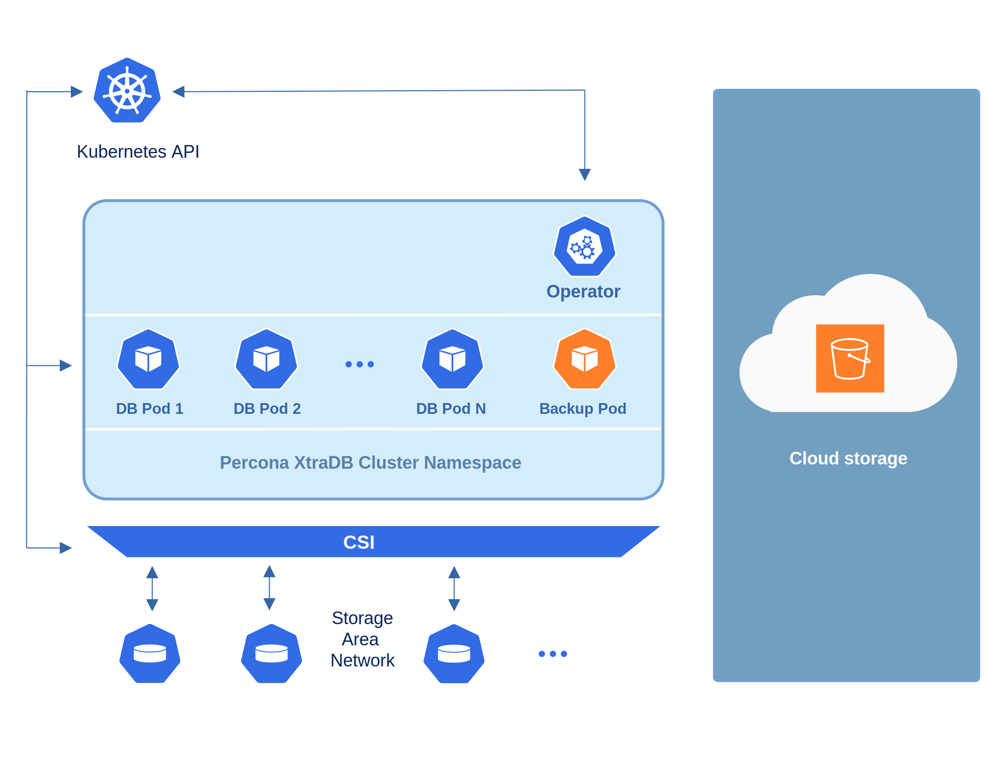
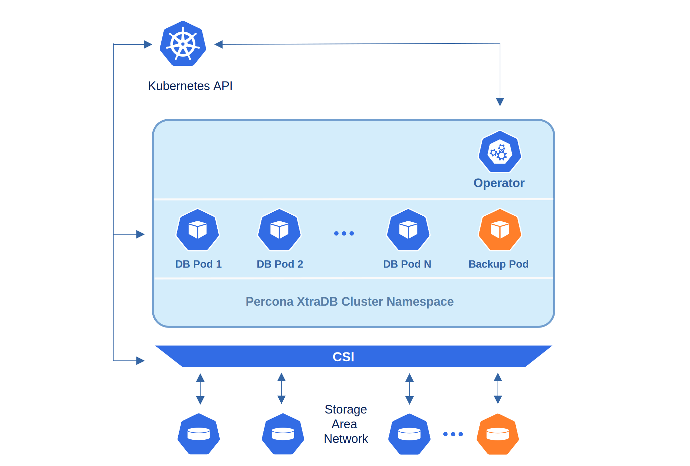

# Providing Backups

It's important to back up your database to keep your data safe. 
Backups help protect your system against data loss and corruption and ensure business stability. They are also a quick way to recover the database if something happens with it.

A backup starts after you create a Backup object. You can create a Backup object in two ways:

* manually at any moment. This way you start an [on-demand backup](backups-ondemand.md).
* instruct the Operator to create it automatically according to a schedule that you define for it. This is a [scheduled backup](backups-scheduled.md).

The Operator does physical backups using the [Percona XtraBackup :octicons-link-external-16:](https://docs.percona.com/percona-xtrabackup/8.0/index.html) tool and the [SST :octicons-link-external-16:](https://galeracluster.com/library/documentation/sst.html) method. 

## Backup storage

You can store backups outside of Kubernetes cluster in one of the supported cloud storages:

* [Amazon S3 or S3-compatible storage :octicons-link-external-16:](https://en.wikipedia.org/wiki/Amazon_S3#S3_API_and_competing_services),
* [Azure Blob Storage :octicons-link-external-16:](https://azure.microsoft.com/en-us/services/storage/blobs/):

If you're running a Kubernetes cluster on premises, you can  store backups inside it using a [Persistent Volume :octicons-link-external-16:](https://kubernetes.io/docs/concepts/storage/persistent-volumes/). For example, if you don't use a remote backup storage or if storage costs are high for you. 

## Workflow

After you create a Backup object, the Operator sets up a backup Pod that runs Percona XtraBackup inside and create a backup Job. It also creates a path in the storage to save the backup data.

The backup Job within the backup Pod starts copying the data files from the Percona XtraDB Cluster to the backup storage. The Percona XtraDB Cluster Pod that serves the data enters the Donor state and stops receiving all requests.

The backup task is resource-consuming and can affect performance. That's why the Operator uses one of the secondary Percona XtraDB Cluster Pods for backups. The exception is a one-pod deployment, where the same Pod is used for all tasks.

After the data files are copied, the Operator marks the backup Pod as 'Completed' and deletes it. The Operator also updates the status of the Backup object.

## Multiple backups

You can run several backups. For example, schedule weekly backups on one storage and daily backups on another one. You can also run an on-demand backup to be on the safe side before you do some maintenance work.  

Several backups run in parallel by default if they happen at the same time. If they overload your cluster, you can turn off parallel backups with the `backup.allowParallel` configuration option in the `cr.yaml` file. Then, the Operator queues the backups and runs them sequentially. 

The Operator ensures the sequence by creating a lock for a running backup. It releases the lock after the backup either succeeds or fails and starts the next one from the queue. The lock is also released if you delete a running backup. 

You can fine-tune the queue by assigning a waiting time for a backup to start. Use the `spec.startingDeadlineSeconds` option in the `deploy/cr.yaml` file to set this time for all backups. You can also override it for a specific  on-demand backup by defining the `startingDeadlineSeconds` option within the backup configuration. This setting has a higher priority.

If the backup doesn't start within the defined time, the Operator automatically marks it as "failed".

## Configure automatic cleanup of backup Jobs and Pods

You can specify the time to live for a backup Job after the backup operation finishes. When the TTL expires, the Operator automatically deletes the Job and its associated Pod.

Use the `backup.ttlSecondsAfterFinished` setting in the `deploy/cr.yaml` file to set this time for all backups, both on-demand and scheduled. This setting also applies for restores.

If it takes longer to finish a backup than the defined `backup.ttlSecondsAfterFinished` value, the Operator applies the `internal.percona.com/keep-job` finalizer to allow the operation to finish. After the operation completes with the Succeeded or Failed status, the finalizer is removed and the Job is cleaned up.

## Backup suspension for an unhealthy database cluster

Your database cluster can become unhealthy. For example, when one of the Pods crashes and restarts. The Operator monitors the database cluster state while a backup is running and suspends it for an unhealthy cluster to reduce the load on the cluster. 

To offload the database cluster even more, you can define how long a backup remains suspended. Use the `spec.backup.suspendedDeadlineSeconds` option in the `cr.yaml` file for all backups. Or set it in the `backup.yaml` configuration files for a specific backup. The setting in the `backup.yaml` file has a higher priority.

After this duration expires, the Operator automatically marks this backup as "failed". 

Otherwise, after the cluster is recovered and reports the Ready status, the Operator resumes the backup and tries to finish it. 

Note that if some files were already saved on the storage when a backup was suspended, the Operator deletes them and reruns the backup. 

If you want to run backups in an unhealthy cluster, set the `spec.unsafeFlags.backupIfUnhealthy` option in the `deploy/cr.yaml` file to `true`. Use this option with caution because it can affect the cluster performance. 

