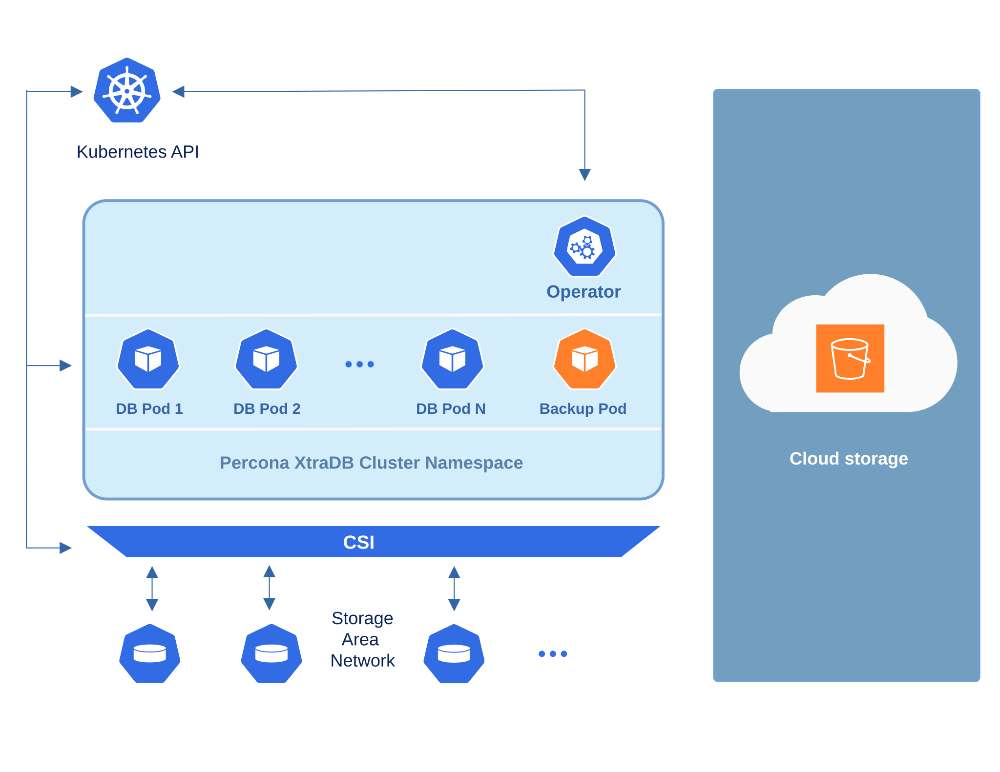
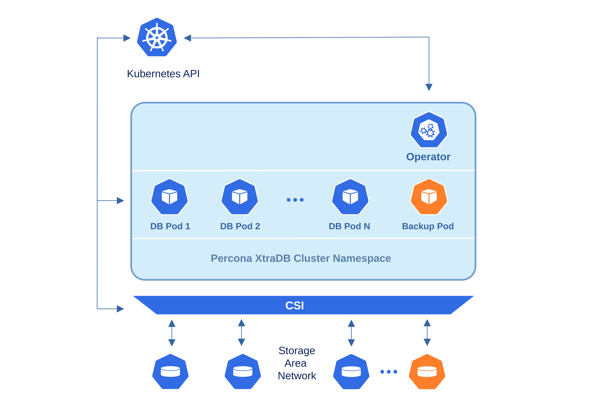

# Providing backups

It's important to back up your database to keep your data safe.
Backups help protect your system against data loss and corruption and ensure business stability. They are also a quick way to recover the database if something happens with it.

A backup starts after you create a Backup object. You can create a Backup object in two ways:

* manually at any moment. This way you start an [on-demand backup](backups-ondemand.md).
* instruct the Operator to create it automatically according to a schedule that you define for it. This is a [scheduled backup](backups-scheduled.md).

The Operator does physical backups using the [Percona XtraBackup :octicons-link-external-16:](https://docs.percona.com/percona-xtrabackup/8.0/index.html) tool. By default, it uses the [SST :octicons-link-external-16:](https://galeracluster.com/library/documentation/sst.html) (State Snapshot Transfer) method, which creates a separate backup Pod to perform backups.

Alternatively, you can enable the XtraBackup sidecar method. This method uses a sidecar container running in each PXC Pod that provides better performance and native encryption support. See [Backup methods](backups-methods.md) for details.

Use the following table to find what you need: a backup type, storage, or the right restore path.

## Choose a path

| Goal | Use | Next step |
| --- | --- | --- |
| Protect data on a regular schedule | Scheduled backup | [Configure storage](backups-storage.md), then set up a [scheduled backup](backups-scheduled.md) |
| Take a one-off backup before a risky change | On-demand backup | [Configure storage](backups-storage.md), then make an [on-demand backup](backups-ondemand.md) |
| Undo a mistake on the cluster that made the backup | Restore in-place | [Restore to the same cluster](backups-restore-in-place.md) |
| Test or inspect data without touching production | Restore to a side cluster | [Restore to a side cluster](backups-restore-side-cluster.md) |
| Migrate or copy data to a different Kubernetes cluster | Restore to a new cluster | [Restore to a new cluster](backups-restore-to-new-cluster.md) |
| Recover after losing the cluster and its Kubernetes environment | Restore after a disaster | [Restore the cluster after a disaster](backups-disaster-restore.md) |
| Land on an exact time or transaction instead of the last full backup | Point-in-time recovery | [Enable PITR](backups-pitr.md), then [restore with PITR](backups-pitr-restore.md) |
| Bring an existing non-Kubernetes database into the cluster | Migrate in | [Use a backup to move an external database into Kubernetes](backups-move-from-external-db.md) |
| Use a backup to move the database off the cluster onto a local machine | Migrate out | [Move a backup out of the cluster](backups-copy.md) |

## Restore options

You can restore a backup:

* [to the same cluster it was made from](backups-restore.md) (in-place)
* [to a side cluster](backups-restore-side-cluster.md) — a new cluster on the same Kubernetes cluster, in the same or a new namespace
* [to a new cluster](backups-restore-to-new-cluster.md) — a new cluster on a different Kubernetes cluster
* [after a disaster](backups-disaster-restore.md) — when nothing but the backup survived

Any of these can also land on an exact time or transaction with point-in-time recovery. 

[Restore from a backup](backups-restore.md){.md-button}

## Migrate data

Moving data across the Kubernetes boundary doesn't go through the Operator's Restore object the way the options above do:

* [migrate an external, non-Kubernetes database into the cluster](backups-move-from-external-db.md) — combines a manual backup, a restore, and asynchronous replication for a low-downtime cutover
* [migrate a backup out of the cluster to a local machine](backups-copy.md) — a manual restore outside Kubernetes, with no Operator involved

## Point-in-time recovery

Point-in-time recovery (PITR) replays binary logs on top of a full backup, so you can land on an exact moment or transaction instead of just the moment the last full backup finished.

For point-in-time recovery, the Operator needs two things:

* **Binary log collection enabled** — the Operator runs a separate Pod that continuously uploads binary logs to storage while the cluster is running.
* **At least one successful full backup** — the Operator always restores a full backup first, then replays binary logs forward from it. Binary logs by themselves can't be restored, and the Operator can't report how far forward you can recover until a full backup exists.

[Enable point-in-time recovery](backups-pitr.md){.md-button}

## Backup storage

You can store backups outside of Kubernetes cluster in one of the supported cloud storages:

* [Amazon S3 or S3-compatible storage :octicons-link-external-16:](https://en.wikipedia.org/wiki/Amazon_S3#S3_API_and_competing_services),
* [Azure Blob Storage :octicons-link-external-16:](https://azure.microsoft.com/en-us/services/storage/blobs/):

If you're running a Kubernetes cluster on premises, you can  store backups inside it using a [Persistent Volume :octicons-link-external-16:](https://kubernetes.io/docs/concepts/storage/persistent-volumes/). For example, if you don't use a remote backup storage or if storage costs are high for you.

## Multiple backups

You can run several backups. For example, schedule weekly backups on one storage and daily backups on another one. You can also run an on-demand backup to be on the safe side before you do some maintenance work.

Several backups run in parallel by default if they happen at the same time. If they overload your cluster, you can turn off parallel backups with the `backup.allowParallel` configuration option in the `cr.yaml` file. Then, the Operator queues the backups and runs them sequentially.

The Operator ensures the sequence by creating a lock for a running backup. It releases the lock after the backup either succeeds or fails and starts the next one from the queue. The lock is also released if you delete a running backup.

You can fine-tune the queue by assigning a waiting time for a backup to start. Use the `spec.startingDeadlineSeconds` option in the `deploy/cr.yaml` file to set this time for all backups. You can also override it for a specific  on-demand backup by defining the `startingDeadlineSeconds` option within the backup configuration. This setting has a higher priority.

If the backup doesn't start within the defined time, the Operator automatically marks it as "failed".

## Configure automatic cleanup of backup Jobs and Pods

You can specify the time to live for a backup Job after the backup operation finishes. When the TTL expires, the Operator automatically deletes the Job and its associated Pod.

Use the `backup.ttlSecondsAfterFinished` setting in the `deploy/cr.yaml` file to set this time for all backups, both on-demand and scheduled. This setting also applies for restores.

If it takes longer to finish a backup than the defined `backup.ttlSecondsAfterFinished` value, the Operator applies the `internal.percona.com/keep-job` finalizer to allow the operation to finish. After the operation completes with the Succeeded or Failed status, the finalizer is removed and the Job is cleaned up.

## Backup suspension for an unhealthy database cluster

Your database cluster can become unhealthy. For example, when one of the Pods crashes and restarts. The Operator monitors the database cluster state while a backup is running and suspends it for an unhealthy cluster to reduce the load on the cluster.

To offload the database cluster even more, you can define how long a backup remains suspended. Use the `spec.backup.suspendedDeadlineSeconds` option in the `cr.yaml` file for all backups. Or set it in the `backup.yaml` configuration files for a specific backup. The setting in the `backup.yaml` file has a higher priority.

After this duration expires, the Operator automatically marks this backup as "failed".

Otherwise, after the cluster is recovered and reports the Ready status, the Operator resumes the backup and tries to finish it.

Note that if some files were already saved on the storage when a backup was suspended, the Operator deletes them and reruns the backup.

If you want to run backups in an unhealthy cluster, set the `spec.unsafeFlags.backupIfUnhealthy` option in the `deploy/cr.yaml` file to `true`. Use this option with caution because it can affect the cluster performance.

## Limits you should know

* Restoring from an `emptyDir` or `hostPath` volume isn't supported, and a Persistent Volume restore only works within the same Kubernetes cluster — see [Restore limitations](backups-restore.md#restore-limitations) for the full breakdown by destination.
* A point-in-time restore always requires a Secret with the same passwords used at backup time; a full-backup restore tolerates changed passwords since Operator 1.18.0 — see [Restore limitations](backups-restore.md#restore-limitations).
* The XtraBackup sidecar backup method doesn't yet support Persistent Volume backups, IAM profiles, or built-in encryption — see [Backup methods](backups-methods.md#xtrabackup-sidecar-method-tech-preview).

## Next step

[Backup methods](backups-methods.md){.md-button}