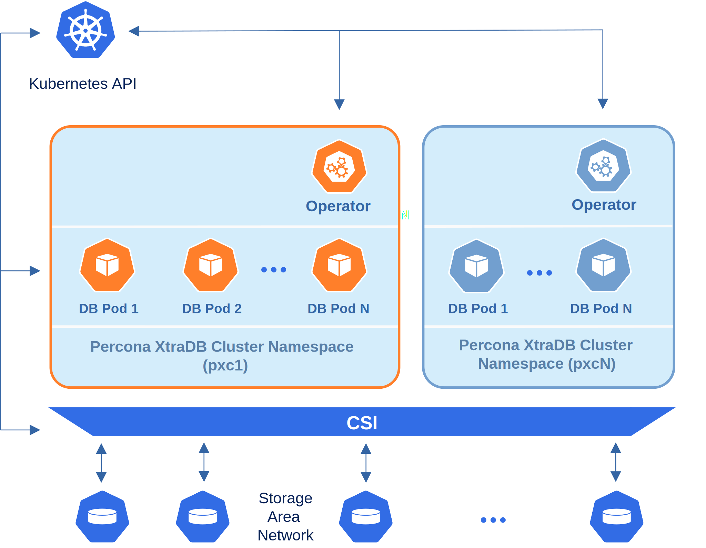
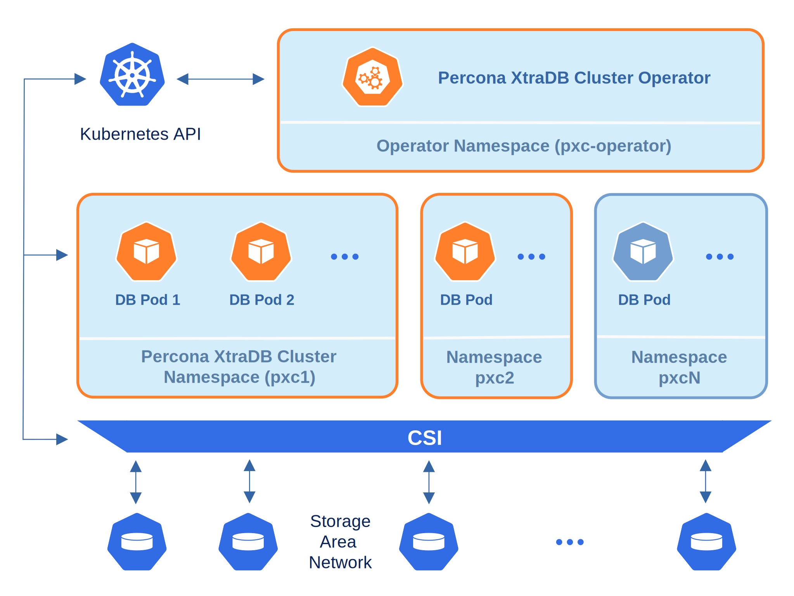

# Percona Operator for MySQL based on Percona XtraDB Cluster single-namespace and multi-namespace deployment

There are two design patterns that you can choose from when deploying Percona Operator for MySQL based on Percona XtraDB Cluster and database clusters in Kubernetes:

* Namespace-scope - one Operator per Kubernetes namespace,

* Cluster-wide - one Operator can manage clusters in multiple namespaces.

This how-to explains how to configure Percona Operator for MySQL based on Percona XtraDB Cluster for each scenario.

## Namespace-scope

By default, Percona Operator for MySQL functions in a specific Kubernetes namespace. You can
create one during the installation (like it is shown in the
[installation instructions](kubernetes.md)) or just use the default namespace. This approach allows several Operators to co-exist in one Kubernetes-based environment, being separated in different namespaces:



Normally this is a recommended approach, as isolation minimizes impact in case of various failure scenarios. This is the default configuration of our Operator.

Let’s say you will use a Kubernetes Namespace called `percona-db-1`.

1. Clone `percona-xtradb-cluster-operator` repository:

    ``` {.bash data-prompt="$" }
    $ git clone -b v{{ release }} git@github.com:percona/percona-xtradb-cluster-operator.git
    $ cd percona-xtradb-cluster-operator
    ```

2. Create your `percona-db-1` Namespace (if it doesn't yet exist) as follows:

    ``` {.bash data-prompt="$" }
    $ kubectl create namespace percona-db-1
    ```

3. Deploy the Operator [using :octicons-link-external-16:](https://kubernetes.io/docs/reference/using-api/server-side-apply/)
    the following command:

    ``` {.bash data-prompt="$" }
    $ kubectl apply --server-side -f deploy/bundle.yaml -n percona-db-1
    ```

4. Once Operator is up and running, deploy the database cluster itself:

    ``` {.bash data-prompt="$" }
    $ kubectl apply -f deploy/cr.yaml -n percona-db-1
    ```

You can deploy multiple clusters in this namespace.

### Add more namespaces

What if there is a need to deploy clusters in another namespace? The solution for namespace-scope deployment is to have more than one Operator. We will use the `percona-db-2` namespace as an example.

1. Create your `percona-db-2` namespace (if it doesn't yet exist) as follows:

    ``` {.bash data-prompt="$" }
    $ kubectl create namespace percona-db-2
    ```

2. Deploy the Operator:

    ``` {.bash data-prompt="$" }
    $ kubectl apply --server-side -f deploy/bundle.yaml -n percona-db-2
    ```

3. Once Operator is up and running deploy the database cluster itself:

    ``` {.bash data-prompt="$" }
    $ kubectl apply -f deploy/cr.yaml -n percona-db-2
    ```

    !!! note

        Cluster names may be the same in different namespaces.

## Installing the Operator in cluster-wide mode

Sometimes it is more convenient to have one Operator watching for
Percona XtraDB Cluster custom resources in several namespaces.

We recommend running Percona Operator for MySQL in a traditional way,
limited to a specific namespace, to limit the blast radius. But it is possible
to run it in so-called *cluster-wide* mode, one Operator watching several
namespaces, if needed:



!!! note

    Please take into account that if several Operators are configured to
    watch the same namespace, it is entirely unpredictable which one will get
    ownership of the Custom Resource in it, so this situation should be avoided.

To use the Operator in such *cluster-wide* mode, you should install it with a
different set of configuration YAML files, which are available in the `deploy`
folder and have filenames with a special `cw-` prefix: e.g.
`deploy/cw-bundle.yaml`.

While using this cluster-wide versions of configuration files, you should set
the following information there:

* `subjects.namespace` option should contain the namespace which will host
    the Operator,
* `WATCH_NAMESPACE` key-value pair in the `env` section should have
    `value` equal to a  comma-separated list of the namespaces to be watched by
    the Operator (or just a blank string to make the Operator deal with
    *all namespaces* in a Kubernetes cluster). Prior to the Operator version
    1.12.0 it was necessary to mention the Operator's own namespace in the list
    of watched namespaces, but now this limitation has gone.

!!! note

    Installing the Operator cluster-wide on OpenShift via the the Operator
    Lifecycle Manager (OLM) requires
    [making different selections in the OLM web-based UI](openshift.md#install-the-operator-via-the-operator-lifecycle-manager-olm)
    instead of patching YAML files.

The following simple example shows how to install Operator cluster-wide on
Kubernetes.


1. First of all, clone the percona-xtradb-cluster-operator repository:

    ``` {.bash data-prompt="$" }
    $ git clone -b v{{ release }} https://github.com/percona/percona-xtradb-cluster-operator
    $ cd percona-xtradb-cluster-operator
    ```

2. Let’s suppose that Operator’s namespace should be the `pxc-operator` one.
    Create it as follows:

    ``` {.bash data-prompt="$" }
    $ kubectl create namespace pxc-operator
    ```

    Namespaces to be watched by the Operator should be created in the same way
    if not exist. Let’s say the Operator should watch the `pxc` namespace:

    ``` {.bash data-prompt="$" }
    $ kubectl create namespace pxc
    ```

3. Edit the ``deploy/cw-bundle.yaml`` configuration file to set proper
    namespaces:

    ```yaml
    ...
    subjects:
    - kind: ServiceAccount
      name: percona-xtradb-cluster-operator
      namespace: "pxc"
    ...
    env:
             - name: WATCH_NAMESPACE
               value: "pxc"
    ...
    ```

4. Apply the `deploy/cw-bundle.yaml` file with the following command:

    ``` {.bash data-prompt="$" }
    $ kubectl apply --server-side -f deploy/cw-bundle.yaml -n pxc-operator
    ```

5. After the Operator is started, Percona XtraDB Cluster can be created at any
    time by applying the `deploy/cr.yaml` configuration file, like in the case
    of normal installation:

    ``` {.bash data-prompt="$" }
    $ kubectl apply -f deploy/cr.yaml -n pxc
    ```

    The creation process will take some time. When the process is over your
    cluster will obtain the `ready` status. You can check it with the following
    command:

    ``` {.bash data-prompt="$" }
    $ kubectl get pxc
    ```

    ??? example "Expected output"

        ``` {.text .no-copy}
        NAME       ENDPOINT                   STATUS   PXC   PROXYSQL   HAPROXY   AGE
        cluster1   cluster1-haproxy.default   ready    3                3         5m51s
        ```

## Verifying the cluster operation

It may take ten minutes to get the cluster started. When `kubectl get pxc`
command finally shows you the cluster status as `ready`, you can try to connect
to the cluster.

1. You will need the login and password for the admin user to access the
    cluster. Use `kubectl get secrets` command to see the list of Secrets
    objects (by default the Secrets object you are interested in has
    `cluster1-secrets` name).
    You can use the following command to get the password of the `root`
    user:
    
    ``` {.bash data-prompt="$" }
    $ kubectl get secrets --namespace=pxc cluster1-secrets --template='{{"{{"}}.data.root | base64decode{{"}}"}}{{"{{"}}"\n"{{"}}"}}'
    ```

2. Run a container with `mysql` client and connect its console output to your
    terminal. The following command will do this, naming the new Pod
    `percona-client`:

    ```{.bash data-prompt="$"}
    $ kubectl run -i --rm --tty percona-client --image=percona:5.7 --restart=Never --env="POD_NAMESPACE=pxc" -- bash -il
    ```
    
    Executing it may require some time to deploy the correspondent Pod.
    
    Now run `mysql` tool in the percona-client command shell using the password
    obtained from the secret instead of the `<root_password>` placeholder. The 
    command will look different depending on whether your cluster provides load
    balancing with [HAProxy](haproxy-conf.md) (the default choice) or
    [ProxySQL](proxysql-conf.md):

    === "with HAProxy (default)"
        ```{.bash data-prompt="$"}
        $ mysql -h cluster1-haproxy -uroot -p'<root_password>'
        ```

    === "with ProxySQL"
        ```{.bash data-prompt="$"}
        $ mysql -h cluster1-proxysql -uroot -p'<root_password>'
        ```

!!! note 

    Some Kubernetes-based environments are specifically configured to have
    communication across Namespaces is not allowed by default network policies.
    In this case, you should specifically allow the Operator communication
    across the needed Namespaces. Following the above example, you would need
    to allow ingress traffic for the `pxc-operator` Namespace from the `pxc`
    Namespace, and also from the `default` Namespace. You can do it with the
    NetworkPolicy resource, specified in the YAML file as follows:
    
    ```yaml
    apiVersion: networking.k8s.io/v1
    kind: NetworkPolicy
    metadata:
      name: percona
      namespace: pxc-operator
    spec:
      ingress:
      - from:
        - namespaceSelector:
            matchLabels:
              kubernetes.io/metadata.name: pxc
        - namespaceSelector:
            matchLabels:
              kubernetes.io/metadata.name: default
      podSelector: {}
      policyTypes:
      - Ingress
    ```
    
    Don't forget to apply the resulting file with the usual `kubectl apply`
    command.

    You can find more details about Network Policies [in the official Kubernetes documentation :octicons-link-external-16:](https://kubernetes.io/docs/concepts/services-networking/network-policies/). 

## Upgrading the Operator in cluster-wide mode

Cluster-wide Operator is upgraded similarly to a single-namespace one. Both deployment variants provide you with the same three upgradable components:

* the Operator;
* [Custom Resource Definition (CRD)](operator.md),
* Database Management System (Percona XtraDB Cluster).
 
To upgrade the cluster-wide Operator you follow the [standard upgrade scenario](update.md#upgrade-the-operator-and-crd) concerning the Operator's namespace and a different YAML configuration file: the one with a special `cw-` prefix, `deploy/cw-rbac.yaml`. The resulting steps will look as follows.

1. Update the [Custom Resource Definition :octicons-link-external-16:](https://kubernetes.io/docs/concepts/extend-kubernetes/api-extension/custom-resources/)
    for the Operator, taking it from the official repository on Github, and do
    the same for the Role-based access control:

    ``` {.bash data-prompt="$" }
    $ kubectl apply --server-side -f https://raw.githubusercontent.com/percona/percona-xtradb-cluster-operator/v{{ release }}/deploy/crd.yaml
    $ kubectl apply --server-side -f https://raw.githubusercontent.com/percona/percona-xtradb-cluster-operator/v{{ release }}/deploy/cw-rbac.yaml
    ```

2. Now you should [apply a patch :octicons-link-external-16:](https://kubernetes.io/docs/tasks/run-application/update-api-object-kubectl-patch/) to your
    deployment, supplying the necessary image name with a newer version tag. You can find the proper
    image name for the current Operator release [in the list of certified images](images.md)
    (for older releases, please refer to the [old releases documentation archive :octicons-link-external-16:](https://docs.percona.com/legacy-documentation/)).
    For example, updating to the `{{ release }}` version in the `pxc-operator` namespace should look as
    follows.

    ``` {.bash data-prompt="$" }
    $ kubectl patch deployment percona-xtradb-cluster-operator \
      -p'{"spec":{"template":{"spec":{"containers":[{"name":"percona-xtradb-cluster-operator","image":"percona/percona-xtradb-cluster-operator:{{ release }}"}]}}}}' -n pxc-operator
    ```

3. The deployment rollout will be automatically triggered by the applied patch.
    You can track the rollout process in real time with the
    `kubectl rollout status` command with the name of your cluster:

    ``` {.bash data-prompt="$" }
    $ kubectl rollout status deployments percona-xtradb-cluster-operator -n pxc-operator
    ```
