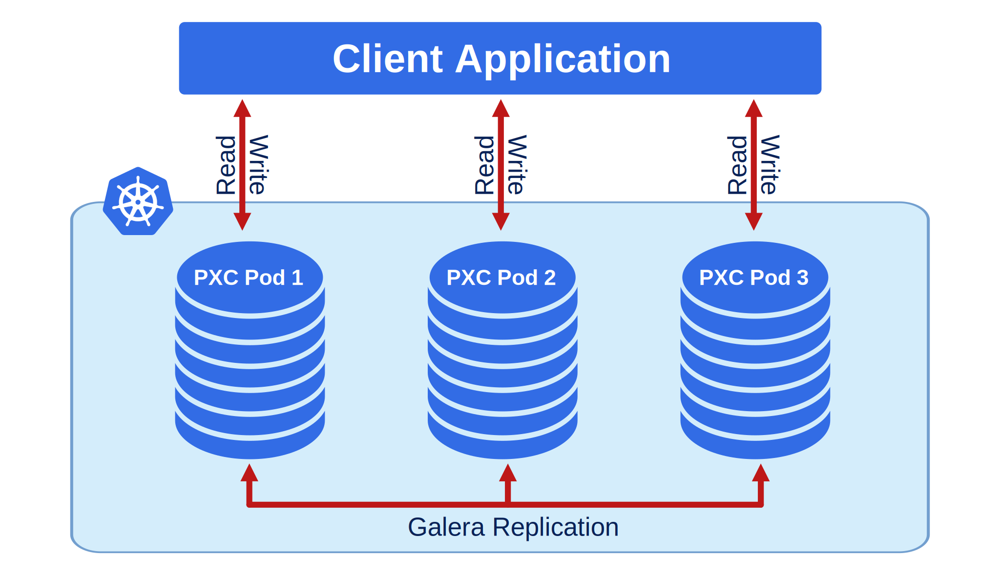

# Exposing cluster

Percona Operator for MySQL based on Percona XtraDB Cluster provides entry points for accessing the database by client
applications in several scenarios. In either way the cluster is exposed with
regular Kubernetes [Service objects](https://kubernetes.io/docs/concepts/services-networking/service/),
configured by the Operator.

This document describes the usage of [Custom Resource manifest options](operator.md#operator-custom-resource-options)
to expose the clusters deployed with the Operator.

The Operator provides a choice of two cluster components to
provide load balancing and proxy service: you can use either [HAProxy](https://haproxy.org) or [ProxySQL](https://proxysql.com/).


### Exposing cluster with HAProxy

Load balancing and proxy service with [HAProxy](https://haproxy.org) is enabled
by default.

You can control whether to use it or not by enabling or disabling it via the
`haproxy.enabled` option in the `deploy/cr.yaml` configuration file.

See [how you can enable or disable HAProxy and what are the limitations](haproxy-conf.md).

The resulting HAProxy setup will contain the `cluster1-haproxy` service
listening on ports 3306 (MySQL primary), 3307 (MySQL replicas), and 3309 (the [proxy protocol](https://www.haproxy.com/blog/haproxy/proxy-protocol/)
useful for operations such as asynchronous calls).

When the cluster is configured in this way, you can find the endpoint (the
public IP address of the load balancer in our example) by getting the Service
object with the `kubectl get service` command:

```{.bash data-prompt="$"}
$ kubectl get service cluster1-haproxy
NAME               TYPE        CLUSTER-IP    EXTERNAL-IP   PORT(S)                      AGE
cluster1-haproxy   ClusterIP   10.76.2.102   <none>        3306/TCP,3307/TCP,3309/TCP   2m32s
```

### Exposing cluster with ProxySQL

Load balancing and proxy service with [ProxySQL](https://proxysql.com/) is disabled
by default.

You can control whether to use it or not by enabling or disabling it via the
`proxysql.enabled` option in the `deploy/cr.yaml` configuration file.

See [how you can enable or disable ProxySQL and what are the limitations](proxysql-conf.md).

When the cluster is configured in this way, you can find the endpoint (the
public IP address of the load balancer in our example) by getting the Service
object with the `kubectl get service` command:

```{.bash data-prompt="$"}
$ kubectl get service cluster1-mysql-primary
NAME                     TYPE           CLUSTER-IP     EXTERNAL-IP     PORT(S)                                                         AGE
cluster1-mysql-primary   LoadBalancer   10.40.37.98    35.192.172.85   3306:32146/TCP,33062:31062/TCP,33060:32026/TCP,6033:30521/TCP   3m31s
```

As you could notice, this command also shows mapped ports the application can
use to communicate with MySQL primary instance (e.g. `3306` for the classic
MySQL protocol, or `33060` for [MySQL X Protocol](https://dev.mysql.com/doc/dev/mysql-server/latest/page_mysqlx_protocol.html)
useful for operations such as asynchronous calls).

## Service per Pod

Still, sometimes it is required to expose all Percona XtraDB Cluster instances,
where each of them gets its own IP address (e.g. in case of load balancing
implemented on the application level).



This is possible by setting the following options in [spec.mysql section](operator.md#operator-mysql-section).

* [pxc.expose.enabled](operator.md#pxc-expose-enabled) enables or disables exposure
    of Percona XtraDB Cluster instances,
* [mysql.expose.type](operator.md#mysql-expose-type) defines the Kubernetes Service
    object type.

The following example creates a dedicated LoadBalancer Service for each node of
the MySQL cluster:

```yaml
pxc:
  expose:
    enabled: true
    type: LoadBalancer
```

When the cluster instances are exposed in this way, you can find the
corresponding Services with the `kubectl get services` command:

```{.bash data-prompt="$"}
$ kubectl get services
NAME                     TYPE           CLUSTER-IP     EXTERNAL-IP     PORT(S)                                                         AGE
...
cluster1-mysql-0         LoadBalancer   10.40.44.110   104.198.16.21   3306:31009/TCP,33062:31319/TCP,33060:30737/TCP,6033:30660/TCP   75s
cluster1-mysql-1         LoadBalancer   10.40.42.5     34.70.170.187   3306:30601/TCP,33062:30273/TCP,33060:30910/TCP,6033:30847/TCP   75s
cluster1-mysql-2         LoadBalancer   10.40.42.158   35.193.50.44    3306:32042/TCP,33062:31576/TCP,33060:31656/TCP,6033:31448/TCP   75s
```

As you could notice, this command also shows mapped ports the application can
use to communicate with MySQL instances (e.g. `3306` for the classic MySQL
protocol, or `33060` for [MySQL X Protocol](https://dev.mysql.com/doc/dev/mysql-server/latest/page_mysqlx_protocol.html)
useful for operations such as asynchronous calls).

Also, you can expose other components of your cluster in a similar way:

* [haproxy.exposePrimary.enabled](operator.md#haproxy-exposePrimary-enabled) enables or disables exposure
    of HAProxy primary instances,
* [haproxy.exposeReplicas.enabled](operator.md#haproxy-exposeReplicas-enabled) enables or disables
    `haproxy-replicas` Service. This Service (on by default) forwards requests to all Percona XtraDB Cluster instances, and it **should not be used for write requests**!
* [proxysql.expose.enabled](operator.md#proxysql-expose-enabled) enables or disables exposure
    of ProxySQL instances,
