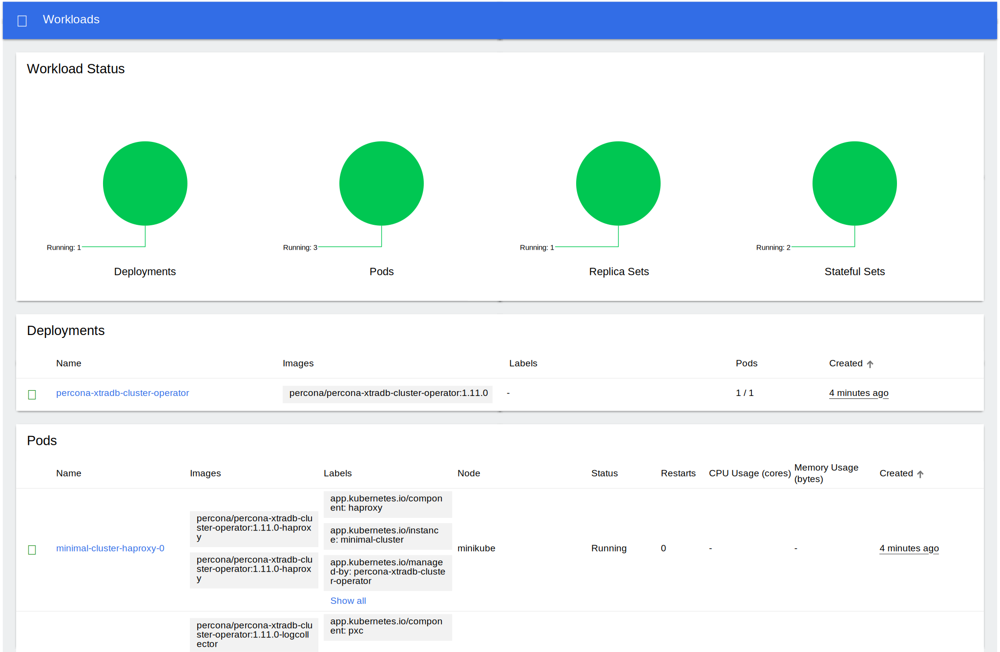

# Install Percona XtraDB Cluster on Minikube

Installing the Percona Operator for MySQL based on Percona XtraDB Cluster on [minikube](https://github.com/kubernetes/minikube)
is the easiest way to try it locally without a cloud provider. Minikube runs
Kubernetes on GNU/Linux, Windows, or macOS system using a system-wide
hypervisor, such as VirtualBox, KVM/QEMU, VMware Fusion or Hyper-V. Using it is
a popular way to test the Kubernetes application locally prior to deploying it
on a cloud.

The following steps are needed to run the Operator and Percona XtraDB Cluster on
Minikube:

1. [Install Minikube](https://kubernetes.io/docs/tasks/tools/install-minikube/),
    using a way recommended for your system. This includes the installation of
    the following three components:

    1. kubectl tool,

    2. a hypervisor, if it is not already installed,

    3. actual Minikube package.

    After the installation, run `minikube start --memory=4096 --cpus=3`
    (parameters increase the virtual machine limits for the CPU cores and memory,
    to ensure stable work of the Operator). Being executed, this command will
    download needed virtualized images, then initialize and run the
    cluster. After Minikube is successfully started, you can optionally run the
    Kubernetes dashboard, which visually represents the state of your cluster.
    Executing `minikube dashboard` will start the dashboard and open it in your
    default web browser.

2. Deploy the operator with the following command:

    ```default
    $ kubectl apply -f https://raw.githubusercontent.com/percona/percona-xtradb-cluster-operator/v{{ release }}/deploy/bundle.yaml
    ```

3. Deploy Percona XtraDB Cluster:

    ```default
    $ kubectl apply -f https://raw.githubusercontent.com/percona/percona-xtradb-cluster-operator/v{{ release }}/deploy/cr-minimal.yaml
    ```

    !!! note

        This deploys one Percona XtraDB Cluster node and one HAProxy node. The
        [deploy/cr-minimal.yaml](https://raw.githubusercontent.com/percona/percona-xtradb-cluster-operator/v{{ release }}/deploy/cr-minimal.yaml) is for minimal non-production deployment.
        For more configuration options please see
        [deploy/cr.yaml](https://raw.githubusercontent.com/percona/percona-xtradb-cluster-operator/v{{ release }}/deploy/cr.yaml) and [Custom Resource Options](operator.md). You can clone the
        repository with all manifests and source code by executing the following
        command:

        ``` {.bash data-prompt="$" }
        $ git clone -b v{{ release }} https://github.com/percona/percona-xtradb-cluster-operator
        ```

        After editing the needed options, apply your modified `deploy/cr.yaml` file as follows:

        ``` {.bash data-prompt="$" }
        $ kubectl apply -f deploy/cr.yaml
        ```

    Creation process will take some time. The process is over when both
    operator and replica set pod have reached their Running status.
    `kubectl get pods` output should look like this:

    ``` {.text .no-copy}
    NAME                                            READY   STATUS    RESTARTS   AGE
    percona-xtradb-cluster-operator-d99c748-sqddq   1/1     Running   0          49m
    minimal-cluster-pxc-0                           3/3     Running   0          47m
    minimal-cluster-haproxy-0                       2/2     Running   0          47m
    ```

    You can also track the progress via the Kubernetes dashboard:

    

4. During previous steps, the Operator has generated several [secrets](https://kubernetes.io/docs/concepts/configuration/secret/), including the
    password for the `root` user, which you will definitely need to access the
    cluster. Use `kubectl get secrets` to see the list of Secrets objects (by
    default Secrets object you are interested in has `minimal-cluster-secrets` name).
    Then `kubectl get secret minimal-cluster-secrets -o yaml` will return the YAML
    file with generated secrets, including the root password which should look as
    follows:

    ```default
    ...
    data:
      ...
      root: cm9vdF9wYXNzd29yZA==
    ```

    Here the actual password is base64-encoded, and
    `echo 'cm9vdF9wYXNzd29yZA==' | base64 --decode` will bring it back to a
    human-readable form.

5. Check connectivity to a newly created cluster.

    First of all, run a MySQL client container and connect its console output to your
    terminal (running it may require some time to deploy the correspondent Pod).
    The following command will do this, naming the new Pod `percona-client`:

    ``` {.bash data-prompt="$" }
    $ kubectl run -i --rm --tty percona-client --image=percona:8.0 --restart=Never -- bash -il
    ```

    Now run `mysql` tool in the percona-client command shell using the password
    obtained from the secret:

    ``` {.bash data-prompt="$" }
    $ mysql -h minimal-cluster-haproxy -uroot -proot_password
    ```

    This command will connect you to the MySQL monitor.

    ``` {.text .no-copy}
    mysql: [Warning] Using a password on the command line interface can be insecure.
    Welcome to the MySQL monitor.  Commands end with ; or \g.
    Your MySQL connection id is 1872
    Server version: 8.0.22-13.1 Percona XtraDB Cluster (GPL), Release rel13, Revision a48e6d5, WSREP version 26.4.3

    Copyright (c) 2009-2021 Percona LLC and/or its affiliates
    Copyright (c) 2000, 2021, Oracle and/or its affiliates.

    Oracle is a registered trademark of Oracle Corporation and/or its
    affiliates. Other names may be trademarks of their respective
    owners.

    Type 'help;' or '\h' for help. Type '\c' to clear the current input statement.
    ```
