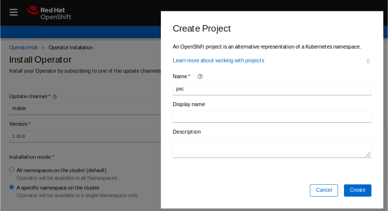
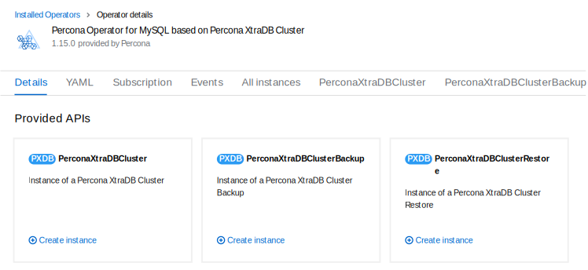

# Install Percona XtraDB Cluster on OpenShift



Percona Operator for Percona XtrabDB Cluster is a [Red Hat Certified Operator :octicons-link-external-16:](https://connect.redhat.com/en/partner-with-us/red-hat-openshift-certification). This means that Percona Operator is portable across hybrid clouds and fully supports the Red Hat OpenShift lifecycle.

Installing Percona XtraDB Cluster on OpenShift includes two steps:


* Installing the Percona Operator for MySQL,


* Install Percona XtraDB Cluster using the Operator.

## Install the Operator

You can install Percona Operator for MySQL on OpenShift using the web interface (the [Operator Lifecycle Manager :octicons-link-external-16:](https://docs.redhat.com/en/documentation/openshift_container_platform/4.2/html/operators/understanding-the-operator-lifecycle-manager-olm#olm-overview_olm-understanding-olm) or [Red Hat Marketplace :octicons-link-external-16:](https://marketplace.redhat.com), or using the command line interface.

### Install the Operator via the Operator Lifecycle Manager (OLM)

Operator Lifecycle Manager (OLM) is a part of the [Operator Framework :octicons-link-external-16:](https://github.com/operator-framework) that allows you to install, update, and manage the Operators lifecycle on the OpenShift platform.

Following steps will allow you to deploy the Operator and Percona XtraDB Cluster on your OLM installation:

1. Login to the OLM and click the needed Operator on the OperatorHub page:

    

    Then click "Contiune", and "Install".

2. A new page will allow you to choose the Operator version and the Namespace / OpenShift project you would like to install the Operator into. 

    

    Click "Install" button to actually install the Operator.

3. When the installation finishes, you can deploy Percona XtraDB Cluster. In the "Operator Details" you will see Provided APIs (Custom Resources, available for installation). Click "Create instance" for the `PerconaXtraDBCluster` Custom Resource. 

    

    You will be able to edit manifest to set needed Custom Resource options, and then click "Create" button to deploy your database cluster.

### Install the Operator via the Red Hat Marketplace

1. login to the Red Hat Marketplace and register your cluster [following the official instructions :octicons-link-external-16:](https://marketplace.redhat.com/en-us/workspace/clusters/add/register).

2. Go to the [Percona Operator for MySQL :octicons-link-external-16:](https://marketplace.redhat.com/en-us/products/percona-kubernetes-operator-for-percona-server-for-xtradb-cluster) page and click the Free trial button:

    

    Here you can “start trial” of the Operator for 0.0 USD.

3. When finished, chose `Workspace->Software` in the system menu on the top and choose the Operator:

    

    Click the `Install Operator` button.

### Install the Operator via the command-line interface

1. Clone the percona-xtradb-cluster-operator repository:

    ``` {.bash data-prompt="$" }
    $ git clone -b v{{ release }} https://github.com/percona/percona-xtradb-cluster-operator
    $ cd percona-xtradb-cluster-operator
    ```

!!! note

    It is crucial to specify the right branch with the -b
    option while cloning the code on this step. Please be careful.

2. Now Custom Resource Definition for Percona XtraDB Cluster should be created
    from the `deploy/crd.yaml` file. Custom Resource Definition extends the
    standard set of resources which Kubernetes “knows” about with the new
    items (in our case ones which are the core of the operator).

    This step should be done only once; it does not need to be repeated
    with the next Operator deployments, etc.

    ``` {.bash data-prompt="$" }
    $ oc apply --server-side -f deploy/crd.yaml
    ```

    !!! note

        Setting Custom Resource Definition requires your user to
        have cluster-admin role privileges.

    If you want to manage your Percona XtraDB Cluster with a non-privileged user,
    necessary permissions can be granted by applying the next clusterrole:

    ``` {.bash data-prompt="$" }
    $ oc create clusterrole pxc-admin --verb="*" --resource=perconaxtradbclusters.pxc.percona.com,perconaxtradbclusters.pxc.percona.com/status,perconaxtradbclusterbackups.pxc.percona.com,perconaxtradbclusterbackups.pxc.percona.com/status,perconaxtradbclusterrestores.pxc.percona.com,perconaxtradbclusterrestores.pxc.percona.com/status
    $ oc adm policy add-cluster-role-to-user pxc-admin <some-user>
    ```

    If you have a [cert-manager :octicons-link-external-16:](https://docs.cert-manager.io/en/release-0.8/getting-started/install/openshift.html) installed, then you have to execute two more commands to be able to     manage certificates with a non-privileged user:

    ``` {.bash data-prompt="$" }
    $ oc create clusterrole cert-admin --verb="*" --resource=issuers.certmanager.k8s.io,certificates.certmanager.k8s.io
    $ oc adm policy add-cluster-role-to-user cert-admin <some-user>
    ```

3. The next thing to do is to create a new `pxc` project:

    ``` {.bash data-prompt="$" }
    $ oc new-project pxc
    ```

4. Now RBAC (role-based access control) for Percona XtraDB Cluster should be set
    up from the `deploy/rbac.yaml` file. Briefly speaking, role-based access is
    based on specifically defined roles and actions corresponding to
    them, allowed to be done on specific Kubernetes resources (details
    about users and roles can be found in [OpenShift documentation :octicons-link-external-16:](https://docs.openshift.com/enterprise/3.0/architecture/additional_concepts/authorization.html)).

    ``` {.bash data-prompt="$" }
    $ oc apply -f deploy/rbac.yaml
    ```

    Finally, it’s time to start the operator within OpenShift:

    ``` {.bash data-prompt="$" }
    $ oc apply -f deploy/operator.yaml
    ```

    !!! note

        You can simplify the Operator installation by applying a single
        `deploy/bundle.yaml` file instead of running commands from the steps
        2 and 4:
        
        ``` {.bash data-prompt="$" }
        $ oc apply --server-side -f deploy/bundle.yaml
        ```
        
        This will automatically create Custom Resource Definition, set up
        role-based access control and install the Operator as one single action.

## Install Percona XtraDB Cluster

1. Now that’s time to add the Percona XtraDB Cluster users [Secrets :octicons-link-external-16:](https://kubernetes.io/docs/concepts/configuration/secret/)
    with logins and passwords to Kubernetes. By default, the Operator generates
    users Secrets automatically, and *no actions are required at this step*.
    
    Still, you can generate and apply your Secrets by your own. In this case,
    place logins and plaintext passwords for the user accounts in the data
    section of the `deploy/secrets.yaml` file; after editing is finished, create
    users Secrets with the following command:

    ``` {.bash data-prompt="$" }
    $ oc create -f deploy/secrets.yaml
    ```

    More details about secrets can be found in [Users](users.md).

2. Now certificates should be generated. By default, the Operator generates
    certificates automatically, and no actions are required at this step. Still,
    you can generate and apply your own certificates as secrets according
    to the [TLS instructions](TLS.md).

3. After the operator is started and user secrets are added, Percona
    XtraDB Cluster can be created at any time with the following command:

    ``` {.bash data-prompt="$" }
    $ oc apply -f deploy/cr.yaml
    ```

    The creation process may take some time. When the process is over your
    cluster will obtain the `ready` status. You can check it with the following
    command:

    ``` {.bash data-prompt="$" }
    $ oc get pxc
    ```

    ??? example "Expected output"

        ``` {.text .no-copy}
        NAME       ENDPOINT                   STATUS   PXC   PROXYSQL   HAPROXY   AGE
        cluster1   cluster1-haproxy.default   ready    3                3         5m51s
        ```

## Verify the cluster operation

It may take ten minutes to get the cluster started. When the `oc get pxc`
command output shows you the cluster status as `ready`, you can try to connect
to the cluster.


