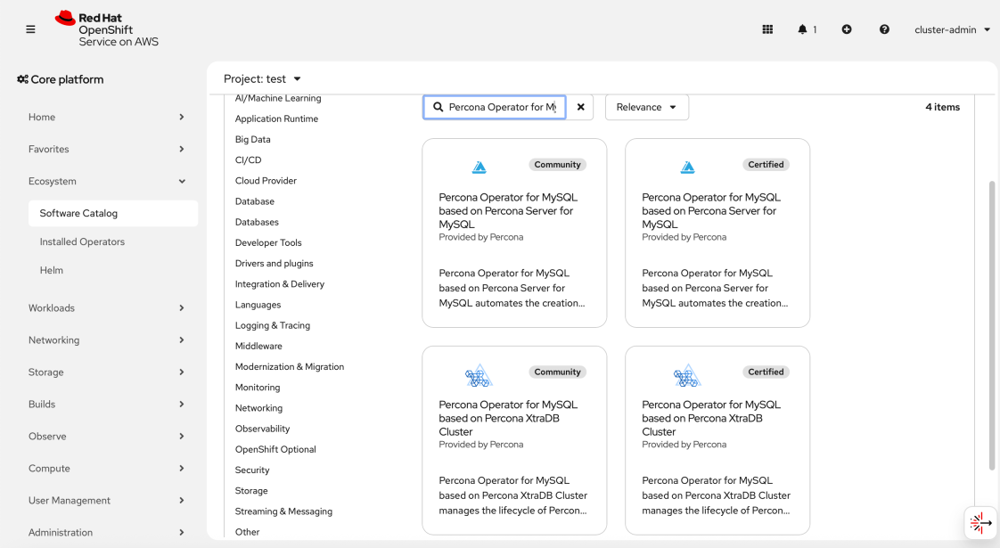
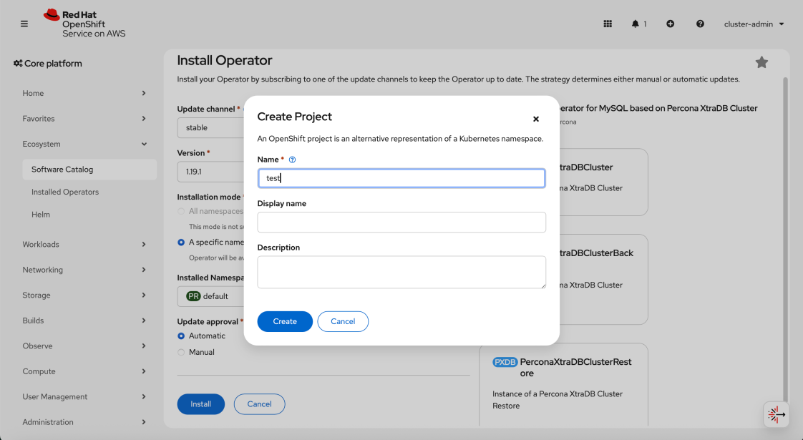
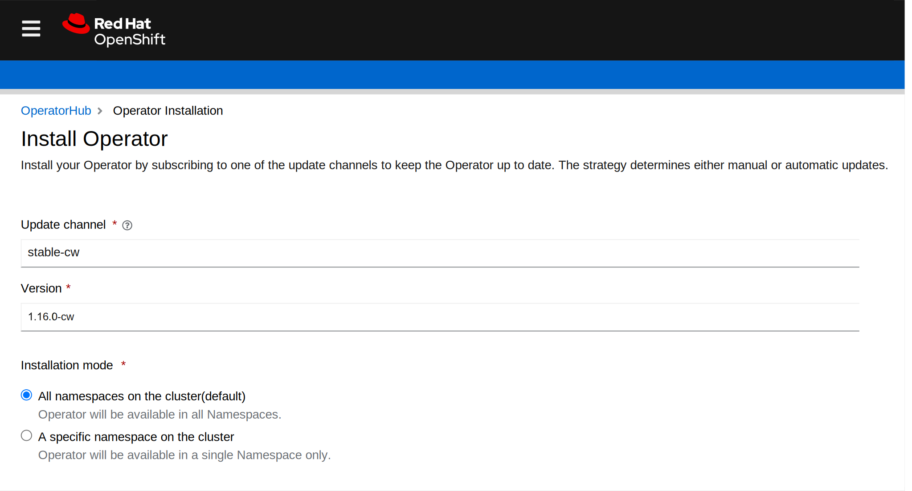
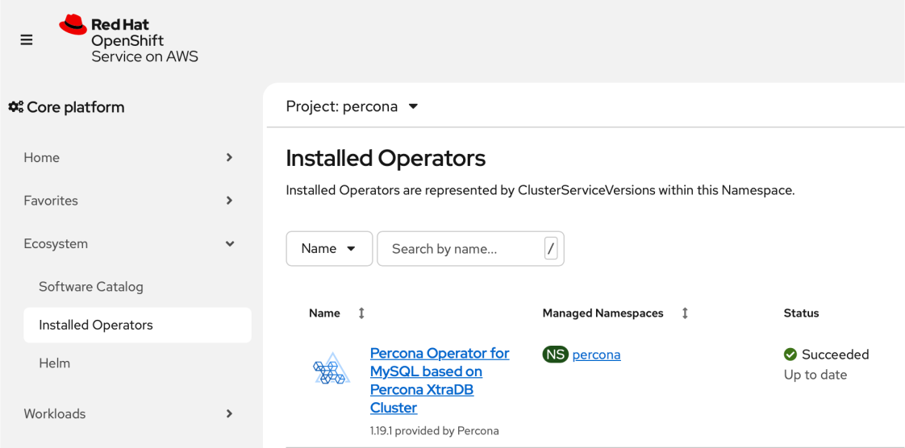
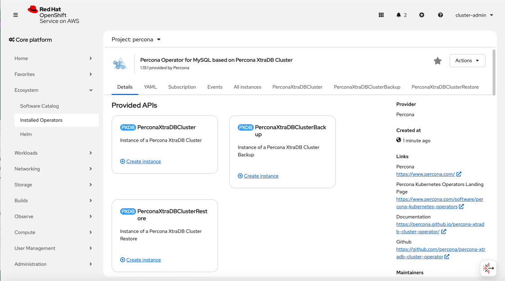

# Install Percona XtraDB Cluster on OpenShift



Percona Operator for Percona XtrabDB Cluster is a [Red Hat Certified Operator :octicons-link-external-16:](https://connect.redhat.com/en/partner-with-us/red-hat-openshift-certification). This means that Percona Operator is portable across hybrid clouds and fully supports the Red Hat OpenShift lifecycle.

To install Percona XtraDB Cluster on OpenShift, you need to do the following:

* First, install the Percona Operator for MySQL Deployment,

* Next, use the Operator to deploy Percona XtraDB Cluster.

## Installation options

You can install Percona Operator for MySQL on OpenShift in two ways:

* **Using the [Operator Lifecycle Manager (OLM) :octicons-link-external-16:](https://docs.redhat.com/en/documentation/openshift_container_platform/4.21/html/operators/understanding-operators#operator-lifecycle-manager-olm)** via the OpenShift web console
* **Using the command-line interface** with `oc` commands

Choose the method that best fits your workflow.

## Install via the Operator Lifecycle Manager (OLM)

### Prerequisites

Before you start, ensure you have the following:

1. You can log in to the OLM console
2. You have the ARN role assigned to your OLM user (for OpenShift 4.20).

### Install the Operator Deployment

Follow these steps to deploy the Operator:

1. Login to the OLM and navigate to the Ecosystem -> Software Catalog.
2. Search for “Percona Operator for MySQL”, select “Percona Operator for MySQL based on Percona XtraDB Cluster”. You may need to change the project for your user:

    

    Then click "Continue", and "Install".

3. A new page opens where you choose the Operator version and the Namespace / OpenShift project you would like to install the Operator into. You can create a namespace (an OpenShift project) right away by clicking the **Create Project** and filling in project details like name, display name and description.

    For OpenShift 4.20, you also need to specify the ARN role assigned to your user

    

    !!! note

        To install the Operator in [multi-namespace (cluster-wide) mode](cluster-wide.md), choose values with `-cw` suffix for the channel and version, and select the "All namespaces on the cluster" radio button for the installation mode instead of choosing a specific Namespace:
        
        

    Click "Install" to install the Operator.

4. You can track the installation flow by clicking the link on the updated page. You will be redirected to the Installed Operators tab. Your installed Operator will appear there.
    
    

### Deploy Percona XtraDB Cluster

Now you can deploy Percona Server for MySQL

1. Click the Operator you installed.
2. On the Details page, find the PerconaXtraDBCluster Custom Resource.
3. Click “Create instance”.
    
    
    
4. Edit the Custom Resource manifest to fine-tune your cluster configuration. Refer to [Custom Resource](operator.md) reference for the description of available options
5. Click “Create”

6. Upon successful installation, you should see the “Ready” status for the database cluster.

## Install via the command-line interface

### Install the Operator Deployment

The following steps install the latest version of the Operator with default parameters. To install a specific version, replace the `v{{ release }}` tag with your value. See the full list of tags [in the Operator repository :octicons-link-external-16:](https://github.com/percona/percona-xtradb-cluster-operator/tags) on GitHub.

To install the Operator with customized parameters, see [Install Percona XtraDB Cluster with customized parameters](custom-install.md).

Choose the approach that fits your needs:

* **Quick install** — Apply a single bundle file. Use this when you want to get started quickly with default settings.
* **Step-by-step install** — Run each installation step separately. Use this when you want more control over the installation process or you need to customize the installation.

=== ":material-rocket-launch: Quick install"

    For a quick and streamlined installation, you can use the `deploy/bundle.yaml` file. By applying this file, Kubernetes creates the Custom Resource Definition, sets up role-based access control and installs the Operator in one single action. This method is recommended for most users, as it simplifies the installation process.
    
    The steps are the following:
    {.power-number}

    1. Clone the `percona-xtradb-cluster-operator` repository. Pay attention to specify the right branch with the `-b` option while cloning the code on this step:

        ```bash
        git clone -b v{{ release }} https://github.com/percona/percona-xtradb-cluster-operator
        cd percona-xtradb-cluster-operator
        ```
    
    2. **For OpenShift 4.19**. Edit the `deploy/bundle.yaml` file. 
    
        - Locate the Deployment custom resource for the Operator.
        - Update the `spec.image` field to 
           
           ```
           docker.io/percona/percona-xtradb-cluster-operator:{{release}}
           ```
    
    3. Create the namespace

        ```bash
        oc new-project pxc
        ```

    4. Create the Custom Resource Definition, RBAC (role-based access control) and the Operator deployment.

        ```bash
        oc apply --server-side -f deploy/bundle.yaml
        ```

=== ":material-format-list-numbered: Step-by-step installation"

    If you prefer to install each component manually, follow these steps:

    1. Clone the repository. Pay attention to specify the right branch with the `-b` option while cloning the code on this step:

        ```bash
        git clone -b v{{ release }} https://github.com/percona/percona-xtradb-cluster-operator
        cd percona-xtradb-cluster-operator
        ```

    2. Create the Custom Resource Definition (CRD)

        The CRD extends Kubernetes with new resource types required by the operator. This step only needs to be done once.

        ```bash
        oc apply --server-side -f deploy/crd.yaml
        ```

        !!! note

            Setting the Custom Resource Definition requires your user to have cluster-admin privileges.

        If you want to manage your Percona XtraDB Cluster with a non-privileged user, grant the necessary permissions by applying the following cluster role:

        ```bash
        oc create clusterrole pxc-admin --verb="*" --resource=perconaxtradbclusters.pxc.percona.com,perconaxtradbclusters.pxc.percona.com/status,perconaxtradbclusterbackups.pxc.percona.com,perconaxtradbclusterbackups.pxc.percona.com/status,perconaxtradbclusterrestores.pxc.percona.com,perconaxtradbclusterrestores.pxc.percona.com/status
        oc adm policy add-cluster-role-to-user pxc-admin <some-user>
        ```

        If you have [cert-manager :octicons-link-external-16:](https://docs.cert-manager.io/en/release-0.8/getting-started/install/openshift.html) installed, run these commands to manage certificates with a non-privileged user:

        ```bash
        oc create clusterrole cert-admin --verb="*" --resource=issuers.certmanager.k8s.io,certificates.certmanager.k8s.io
        oc adm policy add-cluster-role-to-user cert-admin <some-user>
        ```

    3. Create a new project for the cluster

        ```bash
        oc new-project pxc
        ```

    4. Set up RBAC (Role-Based Access Control)

        Apply the RBAC configuration to define roles and permissions for the operator:

        ```bash
        oc apply -f deploy/rbac.yaml
        ```

    5. **For OpenShift 4.19** Edit the `deploy/operator.yaml` and update the `spec.image` field to  `docker.io/percona/percona-xtradb-cluster-operator:{{release}}`:

        ```yaml
        spec:
         containers:
            - command:
              ...
              image: docker.io/percona/percona-xtradb-cluster-operator:{{release}}
        ```
    
    6. Deploy the Operator

        ```bash
        oc apply -f deploy/operator.yaml
        ```

    For more details about users and roles, see the [OpenShift documentation :octicons-link-external-16:](https://docs.openshift.com/enterprise/3.0/architecture/additional_concepts/authorization.html).

### Install Percona XtraDB Cluster

After installing the Operator, you can deploy Percona XtraDB Cluster. This section guides you through the process of setting up secrets, certificates, and creating your first cluster.

#### Before you start

Export the namespace where you deployed the Operator as an environment variable:

```bash
export NAMESPACE=<new-project>
```

#### Step 1: Configure secrets (optional)

By default, the Operator generates users Secrets automatically, so you don't have to do anything. Yet if you wish to use your own Secrets, here's how:

1. Edit the `deploy/secrets.yaml` file to set up your MySQL users and passwords: 
    
    ```yaml
    apiVersion: v1
    kind: Secret
    metadata:
    name: cluster1-secrets
    type: Opaque
    stringData:
    root: root_password
    xtrabackup: backup_password
    monitor: monitory
    proxyadmin: admin_password
    #  pmmserverkey: my_pmm_server_key
    #  pmmservertoken: my_pmm_server_token
    operator: operatoradmin
    replication: repl_password
    ```    

2. Create the Secret with the following command:

    ```bash
    oc create -f deploy/secrets.yaml -n $NAMESPACE
    ```

    To learn more about secrets, see [Users](users.md).

#### Step 2: Configure certificates (optional)

The Operator handles certificate generation automatically so don't have to do anything. However, if you need custom certificates:

1. Generate your certificates
2. Create a secret with your certificates
3. Reference the secret in your cluster configuration

See [TLS instructions](tls-manual.md) for the steps.

#### Step 3: Deploy the database cluster

1. To deploy Percona XtraDB Cluster means to create a Custom Resource for it in OpenShift. The Operator holds a collection of controllers that create and manage this Custom Resource:
    
    The Custom Resource is described by the `deploy/cr.yaml` file. So to create it, you need to apply this file as follows:

    ```bash
    oc apply -f deploy/cr.yaml -n $NAMESPACE
    ```

    The creation process may take some time. When the process is over your
    cluster will obtain the `ready` status. You can check it with the following
    command:

    ```bash
    oc get pxc
    ```

    ??? example "Expected output"

        ``` {.text .no-copy}
        NAME       ENDPOINT                   STATUS   PXC   PROXYSQL   HAPROXY   AGE
        cluster1   cluster1-haproxy.default   ready    3                3         5m51s
        ```

## Verify the cluster operation

It may take ten minutes to get the cluster started. When the `oc get pxc`
command output shows you the cluster status as `ready`, you can try to connect
to the cluster.


