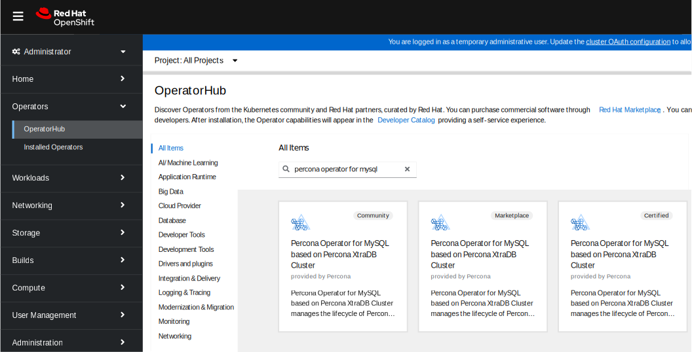

# Install Percona XtraDB Cluster on OpenShift



Percona Operator for Percona XtrabDB Cluster is a [Red Hat Certified Operator :octicons-link-external-16:](https://connect.redhat.com/en/partner-with-us/red-hat-openshift-certification). This means that Percona Operator is portable across hybrid clouds and fully supports the Red Hat OpenShift lifecycle.

Installing Percona XtraDB Cluster on OpenShift includes two steps:

* Installing the Percona Operator for MySQL,

* Install Percona XtraDB Cluster using the Operator.

## Install the Operator

You can install Percona Operator for MySQL on OpenShift using the web interface (the [Operator Lifecycle Manager :octicons-link-external-16:](https://docs.redhat.com/en/documentation/openshift_container_platform/4.2/html/operators/understanding-the-operator-lifecycle-manager-olm#olm-overview_olm)), or using the command line interface.

### Install the Operator via the Operator Lifecycle Manager (OLM)

Operator Lifecycle Manager (OLM) is a part of the [Operator Framework :octicons-link-external-16:](https://github.com/operator-framework) that allows you to install, update, and manage the Operators lifecycle on the OpenShift platform.

Following steps will allow you to deploy the Operator and Percona XtraDB Cluster on your OLM installation:

1. Login to the OLM and click the needed Operator on the OperatorHub page:

    

    Then click "Continue", and "Install".

2. A new page will allow you to choose the Operator version and the Namespace / OpenShift project you would like to install the Operator into.

    

    !!! note

        To install the Operator in [multi-namespace (cluster-wide) mode](cluster-wide.md), use the one from the certified catalog. It has the Certified label. Choose values with `-cw` suffix for the update channel and version, and select the "All namespaces on the cluster" radio button for the installation mode instead of choosing a specific Namespace:
        
        

    Click "Install" to install the Operator.

3. When the installation finishes, you can deploy Percona XtraDB Cluster. In the "Operator Details" you will see Provided APIs (Custom Resources, available for installation). Click "Create instance" for the `PerconaXtraDBCluster` Custom Resource.

    

    You will be able to edit manifest to set needed Custom Resource options, and then click "Create" button to deploy your database cluster.

### Install the Operator via the command-line interface

=== "Single action installation"

    For a quick and streamlined installation, you can use the `deploy/bundle.yaml` file. Applying this single file will automatically create the Custom Resource Definition, set up role-based access control, and install the Operator in one step. This method is recommended for most users, as it simplifies the installation process.
    
    The steps are the following:
    {.power-number}

    1. Clone the `percona-xtradb-cluster-operator` repository. Pay attention to specify the right branch with the -b option while cloning the code on this step:

        ``` {.bash data-prompt="$" }
        $ git clone -b v{{ release }} https://github.com/percona/percona-xtradb-cluster-operator
        $ cd percona-xtradb-cluster-operator
        ```
    
    2. **For OpenShift 4.19**. Edit the `deploy/bundle.yaml` file. 
    
        - Locate the Deployment custom resource for the Operator.
        - Update the `spec.image` field to 
           
           ```
           docker.io/percona/percona-xtradb-cluster-operator:{{release}}
           ```
    
    3. Create the namespace

        ``` {.bash data-prompt="$" }
        $ oc new-project pxc
        ```

    4. Create the Custom Resource Definition, RBAC (role-based access control) and the Operator deployment.

        ``` {.bash data-prompt="$" }
        $ oc apply --server-side -f deploy/bundle.yaml
        ```

=== "Step-by-step installation"

    If you prefer to install each component manually, follow these steps:

    1. Clone the repository. Pay attention to specify the right branch with the -b option while cloning the code on this step:

        ``` {.bash data-prompt="$" }
        $ git clone -b v{{ release }} https://github.com/percona/percona-xtradb-cluster-operator
        $ cd percona-xtradb-cluster-operator
        ```

    2. Create the Custom Resource Definition (CRD)

        The CRD extends Kubernetes with new resource types required by the operator. This step only needs to be done once.

        ``` {.bash data-prompt="$" }
        $ oc apply --server-side -f deploy/crd.yaml
        ```

        !!! note

            Setting the Custom Resource Definition requires your user to have cluster-admin privileges.

        If you want to manage your Percona XtraDB Cluster with a non-privileged user, grant the necessary permissions by applying the following cluster role:

        ``` {.bash data-prompt="$" }
        $ oc create clusterrole pxc-admin --verb="*" --resource=perconaxtradbclusters.pxc.percona.com,perconaxtradbclusters.pxc.percona.com/status,perconaxtradbclusterbackups.pxc.percona.com,perconaxtradbclusterbackups.pxc.percona.com/status,perconaxtradbclusterrestores.pxc.percona.com,perconaxtradbclusterrestores.pxc.percona.com/status
        $ oc adm policy add-cluster-role-to-user pxc-admin <some-user>
        ```

        If you have [cert-manager :octicons-link-external-16:](https://docs.cert-manager.io/en/release-0.8/getting-started/install/openshift.html) installed, run these commands to manage certificates with a non-privileged user:

        ``` {.bash data-prompt="$" }
        $ oc create clusterrole cert-admin --verb="*" --resource=issuers.certmanager.k8s.io,certificates.certmanager.k8s.io
        $ oc adm policy add-cluster-role-to-user cert-admin <some-user>
        ```

    3. Create a new project for the cluster

        ``` {.bash data-prompt="$" }
        $ oc new-project pxc
        ```

    4. Set up RBAC (Role-Based Access Control)

        Apply the RBAC configuration to define roles and permissions for the operator:

        ``` {.bash data-prompt="$" }
        $ oc apply -f deploy/rbac.yaml
        ```

    5. **For OpenShift 4.19** Edit the `deploy/operator.yaml` and update the `spec.image` field to  `docker.io/percona/percona-xtradb-cluster-operator:{{release}}`:

        ```yaml
        spec:
         containers:
            - command:
              ...
              image: docker.io/percona/percona-xtradb-cluster-operator:{{release}}
        ```
    
    6. Deploy the Operator

        ``` {.bash data-prompt="$" }
        $ oc apply -f deploy/operator.yaml
        ```

    For more details about users and roles, see the [OpenShift documentation :octicons-link-external-16:](https://docs.openshift.com/enterprise/3.0/architecture/additional_concepts/authorization.html).

## Install Percona XtraDB Cluster

1. Now that’s time to add the Percona XtraDB Cluster users [Secrets :octicons-link-external-16:](https://kubernetes.io/docs/concepts/configuration/secret/)
    with logins and passwords to Kubernetes. By default, the Operator generates
    users Secrets automatically, and *no actions are required at this step*.

    Still, you can generate and apply your Secrets by your own. In this case,
    place logins and plaintext passwords for the user accounts in the data
    section of the `deploy/secrets.yaml` file; after editing is finished, create
    users Secrets with the following command:

    ``` {.bash data-prompt="$" }
    $ oc create -f deploy/secrets.yaml
    ```

    More details about secrets can be found in [Users](users.md).

2. Now certificates should be generated. By default, the Operator generates
    certificates automatically, and no actions are required at this step. Still,
    you can generate and apply your own certificates as secrets according
    to the [TLS instructions](TLS.md).

3. After the operator is started and user secrets are added, Percona
    XtraDB Cluster can be created at any time with the following command:

    ``` {.bash data-prompt="$" }
    $ oc apply -f deploy/cr.yaml
    ```

    The creation process may take some time. When the process is over your
    cluster will obtain the `ready` status. You can check it with the following
    command:

    ``` {.bash data-prompt="$" }
    $ oc get pxc
    ```

    ??? example "Expected output"

        ``` {.text .no-copy}
        NAME       ENDPOINT                   STATUS   PXC   PROXYSQL   HAPROXY   AGE
        cluster1   cluster1-haproxy.default   ready    3                3         5m51s
        ```

## Verify the cluster operation

It may take ten minutes to get the cluster started. When the `oc get pxc`
command output shows you the cluster status as `ready`, you can try to connect
to the cluster.


