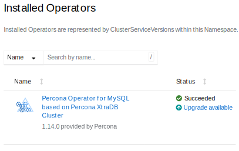

# Upgrade Database and Operator

You can upgrade Percona Operator for MySQL based on Percona XtraDB Cluster starting from the version 1.1.0.

The upgrade process consists of these steps:

* Upgrade the [Custom Resource Definition (CRD)](operator.md) and the Operator  
* Upgrade the database (Percona XtraDB Cluster).

!!! note

    If you run the Operator on [Red Hat Marketplace :octicons-link-external-16:](https://marketplace.redhat.com) or you run Red Hat certified Operators on [OpenShift :octicons-link-external-16:](https://www.redhat.com/en/technologies/cloud-computing/openshift), you need to do additional steps during the upgrade. See [this HOWTO](update_openshift.md) for details.

The list of recommended upgrade scenarios includes two variants:

* Upgrade to the new versions of the Operator *and* Percona XtraDB Cluster,
* Minor Percona XtraDB Cluster version upgrade *without* the Operator upgrade.

## Upgrade the Operator and CRD

### Considerations

1. The Operator version has three digits separated by a dot (`.`) in the format `major.minor.patch`. Here's how you can understand the version `1.16.1`:

    * `1` is the major version 
    * `16` is the minor version
    * `1` is the patch version.     

    You can only upgrade the Operator to the nearest `major.minor` version (for example, from `1.15.1` to `1.16.1`).     

    If the your current Operator version and the version you want to upgrade to differ by more than one minor version, you need to upgrade step by step. For example, if your current version is `1.14.x` and you want to move to `1.16.x`, first upgrade to `1.15.x`, then to `1.16.x`.    

    Patch versions don't influence the upgrade, so you can safely move from `1.15.1` to `1.16.1`. 

    Check the [Release notes index](ReleaseNotes/index.md) for the list of the Operator versions.

2. CRD supports the **last 3 minor versions of the Operator**. This means it is
compatible with the newest Operator version and the two older minor versions.
If the Operator is older than the CRD *by no more than two versions*, you
should be able to continue using the old Operator version.
But updating the CRD *and* Operator is the **recommended path**. 

3. Starting with version 1.12.0, the Operator no longer has a separate API version for each release in CRD. Instead, the CRD has the API version `v1`. Therefore, if you installed the CRD when the Operator version was **older than 1.12.0**, you must update the API version in the CRD manually to run the upgrade. To check your CRD version, use the following command:

    ```{.bash data-prompt="$"}
    $ kubectl get crd perconaxtradbclusters.pxc.percona.com -o yaml | yq .status.storedVersions
    ```

    ??? example "Expected output"

        ```{.text .no-copy}
        - v1-11-0
        - v1
        ```

4. The Operator versions 1.14.0 and 1.15.0 **should be excluded** from the incremental upgrades sequence in favor of [1.14.1](ReleaseNotes/Kubernetes-Operator-for-PXC-RN1.14.1.md) and [1.15.1](ReleaseNotes/Kubernetes-Operator-for-PXC-RN1.15.1.md) releases.

    * The upgrade path from the version 1.14.1 should be 1.14.1 -> 1.15.1. 
    * Direct upgrades from 1.13.0 to 1.14.1 and from 1.14.0 to 1.15.1 are supported.


* To upgrade multiple [single-namespace Operator deployments](cluster-wide.md#namespace-scope) 
in one Kubernetes cluster, where each Operator controls a database cluster in
its own namespace, do the following:

    * upgrade the CRD (not 3 minor versions far from the oldest Operator
       installation in the Kubernetes cluster) first 
    * upgrade the Operators in each namespace incrementally to the
       latest minor version (e.g. from 1.15.1 to 1.16.1, then to 1.17.0) 

    
### Manual upgrade

The upgrade includes the following steps.

1. **For Operators older than v1.12.0**: Update the API version in the [Custom Resource Definition :octicons-link-external-16:](https://kubernetes.io/docs/concepts/extend-kubernetes/api-extension/custom-resources/):

    === "Manually"

        ```{.bash data-prompt="$"}
        $ kubectl proxy &  \
        $ curl \
               --header "Content-Type: application/json-patch+json" \
               --request PATCH \
               --data '[{"op": "replace", "path": "/status/storedVersions", "value":["v1"]}]' http://localhost:8001/apis/apiextensions.k8s.io/v1/customresourcedefinitions/perconaxtradbclusters.pxc.percona.com/status
        ```

        ??? example "Expected output"

            ```{.text .no-copy}
            {
             {...},
              "status": {
                "storedVersions": [
                  "v1"
                ]
              }
            }
            ```

    === "Via `kubectl patch`"

        ```{.bash data-prompt="$"}
        $ kubectl patch customresourcedefinitions perconaxtradbclusters.pxc.percona.com --subresource='status' --type='merge' -p '{"status":{"storedVersions":["v1"]}}'
        ```

        ??? example "Expected output"

            ```{.text .no-copy}
            customresourcedefinition.apiextensions.k8s.io/perconaxtradbclusters.pxc.percona.com patched
            ```


2. Update the Custom Resource Definition for the Operator, taking it from the official repository on Github, and do
    the same for the Role-based access control:

    ``` {.bash data-prompt="$" }
    $ kubectl apply --server-side -f https://raw.githubusercontent.com/percona/percona-xtradb-cluster-operator/v{{ release }}/deploy/crd.yaml
    $ kubectl apply --server-side -f https://raw.githubusercontent.com/percona/percona-xtradb-cluster-operator/v{{ release }}/deploy/rbac.yaml
    ```

3. Now you should [apply a patch :octicons-link-external-16:](https://kubernetes.io/docs/tasks/run-application/update-api-object-kubectl-patch/) to your
    deployment, supplying necessary image name with a newer version tag. You can find the proper
    image name for the current Operator release [in the list of certified images](images.md)
    (for older releases, please refer to the [old releases documentation archive :octicons-link-external-16:](https://docs.percona.com/legacy-documentation/))).
    For example, updating to the `{{ release }}` version should look as
    follows.

    ``` {.bash data-prompt="$" }
    $ kubectl patch deployment percona-xtradb-cluster-operator \
      -p'{"spec":{"template":{"spec":{"containers":[{"name":"percona-xtradb-cluster-operator","image":"percona/percona-xtradb-cluster-operator:{{ release }}"}]}}}}'
    ```

4. The deployment rollout will be automatically triggered by the applied patch.
   The update process is successfully finished when all Pods have been restarted.

    !!! note

        Labels set on the Operator Pod will not be updated during upgrade.

### Upgrade via helm

If you have [installed the Operator using Helm](helm.md), you can upgrade the
Operator with the `helm upgrade` command.

!!! note

    You can use `helm upgrade` to upgrade the Operator only. The Database Management System (Percona XtraDB Cluster) should be upgraded in the same way whether you used helm to install it or not.

1. Update the [Custom Resource Definition :octicons-link-external-16:](https://kubernetes.io/docs/concepts/extend-kubernetes/api-extension/custom-resources/)
    for the Operator, taking it from the official repository on Github, and do
    the same for the Role-based access control:

    ``` {.bash data-prompt="$" }
    $ kubectl apply --server-side -f https://raw.githubusercontent.com/percona/percona-xtradb-cluster-operator/v{{ release }}/deploy/crd.yaml
    $ kubectl apply --server-side -f https://raw.githubusercontent.com/percona/percona-xtradb-cluster-operator/v{{ release }}/deploy/rbac.yaml
    ```

2. If you installed the Operator with no [customized parameters :octicons-link-external-16:](https://github.com/percona/percona-helm-charts/tree/main/charts/pxc-operator#installing-the-chart), the upgrade can be done as follows: 

    ``` {.bash data-prompt="$" }
    $ helm upgrade my-op percona/pxc-operator --version {{ release }}
    ```

    The `my-op` parameter in the above example is the name of a [release object :octicons-link-external-16:](https://helm.sh/docs/intro/using_helm/#three-big-concepts)
    which which you have chosen for the Operator when installing its Helm chart.

    If the Operator was installed with some [customized parameters :octicons-link-external-16:](https://github.com/percona/percona-helm-charts/tree/main/charts/pxc-operator#installing-the-chart), you should list these options in the upgrade command.
    
    
    !!! note
    
        You can get list of used options in YAML format with the `helm get values my-op -a > my-values.yaml` command, and this file can be directly passed to the upgrade command as follows:

        ``` {.bash data-prompt="$" }
        $ helm upgrade my-op percona/pxc-operator --version {{ release }} -f my-values.yaml
        ```

### Upgrade via Operator Lifecycle Manager (OLM)

If you have [installed the Operator on the OpenShift platform using OLM](openshift.md#install-the-operator-via-the-operator-lifecycle-manager-olm), you can upgrade the Operator within it.

1. List installed Operators for your Namespace to see if there are upgradable items.

    

2. Click the "Upgrade available" link to see upgrade details, then click "Preview InstallPlan" button, and finally "Approve" to upgrade the Operator.

## Upgrading Percona XtraDB Cluster

The following section presumes that you are upgrading your cluster within the
*Smart Update strategy*, when the Operator controls how the objects
are updated. Smart Update strategy is on when the `updateStrategy` key in the
[Custom Resource](operator.md) configuration file is set to `SmartUpdate`
(this is the default value and the recommended way for upgrades).

As an alternative, the `updateStrategy` key can be set to `RollingUpdate` and
`OnDelete`. You can find out more about it in the [appropriate section](update.md#more-on-upgrade-strategies).

!!! warning

    The upgrade covers various components of the cluster including PMM Client
    and HA Proxy, which may need additional attention.
    
    *  It is [highly recommended to upgrade PMM Server :octicons-link-external-16:](https://docs.percona.com/percona-monitoring-and-management/2/how-to/upgrade.html) **before** upgrading PMM Client.
    
    * If you are using [custom configuration for HAProxy](haproxy-conf.md#passing-custom-configuration-options-to-haproxy), 
        **before upgrading**, check the HAProxy configuration file provided by
        the Operator (for example, `haproxy-global.cfg` for the Operator version
        {{ release }} can be found [here :octicons-link-external-16:](https://github.com/percona/percona-docker/blob/pxc-operator-{{ release }}/haproxy/dockerdir/etc/haproxy/haproxy-global.cfg)).
        Make sure that your custom config is still compatible with the new
        variant, and make necessary additions, if needed.

### Manual upgrade

Manual update of Percona XtraDB Cluster can be done as follows:

1. Make sure that `spec.updateStrategy` option in the [Custom Resource](operator.md)
    is set to `SmartUpdate`, `spec.upgradeOptions.apply` option is set to `Never`
    or `Disabled` (this means that the Operator will not carry on upgrades
    automatically).
    
    ```yaml
    ...
    spec:
      updateStrategy: SmartUpdate
      upgradeOptions:
        apply: Disabled
        ...
    ```

2. Now [apply a patch :octicons-link-external-16:](https://kubernetes.io/docs/tasks/run-application/update-api-object-kubectl-patch/)
    to your Custom Resource, setting necessary Custom Resource version and image
    names with a newer version tag.

    !!! note

        Check the version of the Operator you have in your Kubernetes
        environment. Please refer to the [Operator upgrade guide](update.md#upgrading-the-operator-and-crd)
        to upgrade the Operator and CRD, if needed.

    Patching Custom Resource is done with the `kubectl patch pxc` command.
    Actual image names can be found [in the list of certified images](images.md)
    (for older releases, please refer to the [old releases documentation archive :octicons-link-external-16:](https://docs.percona.com/legacy-documentation/)).
    For example, updating `cluster1` cluster to the `{{ release }}` version
    should look as follows:

    === "For Percona XtraDB Cluster 8.0"
        ```bash
        $ kubectl patch pxc cluster1 --type=merge --patch '{
           "spec": {
               "crVersion":"{{ release }}",
               "pxc":{ "image": "percona/percona-xtradb-cluster:{{ pxc80recommended }}" },
               "proxysql": { "image": "percona/proxysql2:{{ proxysqlrecommended }}" },
               "haproxy":  { "image": "percona/haproxy:{{ haproxyrecommended }}" },
               "backup":   { "image": "percona/percona-xtradb-cluster-operator:{{ release }}-pxc8.0-backup-pxb{{ pxb80recommended }}" },
               "logcollector": { "image": "percona/percona-xtradb-cluster-operator:{{ release }}-logcollector-fluentbit{{ fluentbitrecommended }}" },
               "pmm":      { "image": "percona/pmm-client:{{ pmm2recommended }}" }
           }}'
        ```

    === "For Percona XtraDB Cluster 5.7"
        ```bash
        $ kubectl patch pxc cluster1 --type=merge --patch '{
           "spec": {
               "crVersion":"{{ release }}",
               "pxc":{ "image": "percona/percona-xtradb-cluster:{{ pxc57recommended }}" },
               "proxysql": { "image": "percona/proxysql2:{{ proxysqlrecommended }}" },
               "haproxy":  { "image": "percona/haproxy:{{ haproxyrecommended }}" },
               "backup":   { "image": "percona/percona-xtradb-cluster-operator:{{ release }}-pxc5.7-backup-pxb{{ pxb57recommended }}" },
               "logcollector": { "image": "percona/percona-xtradb-cluster-operator:{{ release }}-logcollector-fluentbit{{ fluentbitrecommended }}" },
               "pmm":      { "image": "percona/pmm-client:{{ pmm2recommended }}" }
           }}'
        ```

    !!! warning

        The above command upgrades various components of the cluster including PMM Client. If you didn't follow the [official recommendation :octicons-link-external-16:](https://docs.percona.com/percona-monitoring-and-management/2/how-to/upgrade.html) to upgrade PMM Server before upgrading PMM Client, you can avoid PMM Client upgrade by removing it from the list of images as follows:

        === "For Percona XtraDB Cluster 8.0"
            ```bash
            $ kubectl patch pxc cluster1 --type=merge --patch '{
               "spec": {
                   "crVersion":"{{ release }}",
                   "pxc":{ "image": "percona/percona-xtradb-cluster:{{ pxc80recommended }}" },
                   "proxysql": { "image": "percona/proxysql2:{{ proxysqlrecommended }}" },
                   "haproxy":  { "image": "percona/haproxy:{{ haproxyrecommended }}" },
                   "backup":   { "image": "percona/percona-xtradb-cluster-operator:{{ release }}-pxc8.0-backup-pxb{{ pxb80recommended }}" },
                   "logcollector": { "image": "percona/percona-xtradb-cluster-operator:{{ release }}-logcollector-fluentbit{{ fluentbitrecommended }}" }
               }}'
            ```

        === "For Percona XtraDB Cluster 5.7"
            ```bash
            $ kubectl patch pxc cluster1 --type=merge --patch '{
               "spec": {
                   "crVersion":"{{ release }}",
                   "pxc":{ "image": "percona/percona-xtradb-cluster:{{ pxc57recommended }}" },
                   "proxysql": { "image": "percona/proxysql2:{{ proxysqlrecommended }}" },
                   "haproxy":  { "image": "percona/haproxy:{{ haproxyrecommended }}" },
                   "backup":   { "image": "percona/percona-xtradb-cluster-operator:{{ release }}-pxc5.7-backup-pxb{{ pxb57recommended }}" },
                   "logcollector": { "image": "percona/percona-xtradb-cluster-operator:{{ release }}-logcollector-fluentbit{{ fluentbitrecommended }}" }
               }}'
            ```

3. The deployment rollout will be automatically triggered by the applied patch.
    You can track the rollout process in real time with the
    `kubectl rollout status` command with the name of your cluster:

    ```default
    $ kubectl rollout status sts cluster1-pxc
    ```

### Automated upgrade

If you have [*Smart Update strategy* turned on](#more-on-upgrade-strategies), you can automate upgrades even more with the `upgradeOptions.apply` option. In this case
the Operator can either detect the availability of the new Percona XtraDB
Cluster version, or rely on the your choice of the version. To check the
availability of the new version, the Operator will query a special
*Version Service* server at scheduled times to obtain fresh information about
version numbers and valid image paths.

If the current version should be upgraded, the Operator updates the Custom
Resource to reflect the new image paths and carries on sequential Pods deletion,
allowing StatefulSet to redeploy the cluster Pods with the new image.
You can configure Percona XtraDB Cluster upgrade via the `deploy/cr.yaml`
configuration file as follows:

1. Make sure that `spec.updateStrategy` option is set to `SmartUpdate`.

2. Change `spec.crVersion` option to match the version of the Custom Resource
    Definition upgrade [you have done](update.md#manual-upgrade) while upgrading
    the Operator:

    ```yaml
    ...
    spec:
      crVersion: {{ release }}
      ...
    ```
    
    !!! note

        If you don't update crVersion, minor version upgrade is the only one to
        occur. For example, the image `percona-xtradb-cluster:8.0.25-15.1` can
        be upgraded to `percona-xtradb-cluster:8.0.27-18.1`.

3. Change the `upgradeOptions.apply`  option from `Disabled` to one of the
    following values:

    * `Recommended` - [scheduled](operator.md#upgradeoptionsschedule) upgrades
        will choose the most recent version of software flagged as "Recommended"
        (for clusters created from scratch, the Percona XtraDB Cluster 8.0
        version will be selected instead of the Percona XtraDB Cluster 5.7 one
        regardless of the image path; for already existing clusters, the 8.0 vs.
        5.7 branch choice will be preserved),

    * `8.0-recommended`, `5.7-recommended` - same as above, but preserves
        specific major Percona XtraDB Cluster version for newly provisioned
        clusters (ex. 8.0 will not be automatically used instead of 5.7),

    * `Latest` - automatic upgrades will choose the most recent version of
        the software available,

    * `8.0-latest`, `5.7-latest` - same as above, but preserves specific
        major Percona XtraDB Cluster version for newly provisioned
        clusters (ex. 8.0 will not be automatically used instead of 5.7),

    * *version number* - specify the desired version explicitly
        (version numbers are specified as `{{ pxc80recommended }}`,
        `{{ pxc57recommended }}`, etc.). Actual versions can be found
        [in the list of certified images](images.md)
        (for older releases, please refer to the
        [old releases documentation archive :octicons-link-external-16:](https://docs.percona.com/legacy-documentation/)).

4. Make sure the `upgradeOptions.versionServiceEndpoint` key is set to a valid
    Version Server URL (otherwise upgrades will not occur).

    === "Percona’s Version Service (default)"
        You can use the URL of the official Percona’s Version Service (default).
        Set `upgradeOptions.versionServiceEndpoint` to `https://check.percona.com`.

    === "Version Service inside your cluster"
        Alternatively, you can run Version Service inside your cluster. This
        can be done with the `kubectl` command as follows:

        ``` {.bash data-prompt="$" }
        $ kubectl run version-service --image=perconalab/version-service --env="SERVE_HTTP=true" --port 11000 --expose
        ```

    !!! note

        Version Service is never checked if automatic updates are disabled in 
        the `upgradeOptions.apply` option. If automatic updates are enabled, but
        the Version Service URL can not be reached, no updgrades will be
        performed.

5. Use the `upgradeOptions.schedule` option to specify the update check time in CRON format.

    The following example sets the midnight update checks with the official
    Percona’s Version Service:

    ```yaml
    spec:
      updateStrategy: SmartUpdate
      upgradeOptions:
        apply: Recommended
        versionServiceEndpoint: https://check.percona.com
        schedule: "0 0 * * *"
    ...
    ```

    !!! note

        You can force an immediate upgrade by changing the schedule to
        `* * * * *` (continuously check and upgrade) and changing it back to
        another more conservative schedule when the upgrade is complete.

6. Don't forget to apply your changes to the Custom Resource in the usual way:

    ``` {.bash data-prompt="$" }
    $ kubectl apply -f deploy/cr.yaml
    ```

## More on upgrade strategies

The recommended way to upgrade your cluster is to use the
*Smart Update strategy*, when the Operator controls how the objects
are updated. Smart Update strategy is on when the `updateStrategy` key in the
[Custom Resource](operator.md) configuration file is set to `SmartUpdate`
(this is the default value and the recommended way for upgrades).

Alternatively, you can set this key to `RollingUpdate` or `OnDelete`, which
means that you will have to
[follow the low-level Kubernetes way of database upgrades](update_manually.md).
But take into account, that `SmartUpdate` strategy is not just for simplifying
upgrades. Being turned on, it allows to disable automatic upgrades, and still
controls restarting Pods in a proper order for changes triggered by other
events, such as updating a ConfigMap, rotating a password, or changing resource
values. That's why `SmartUpdate` strategy is useful even when you have no plans
to automate upgrades at all.
